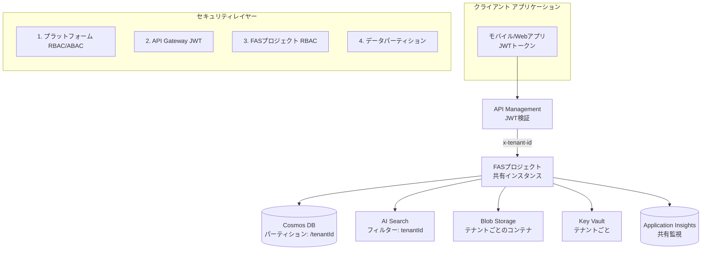
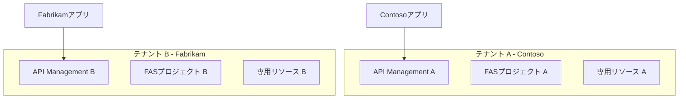

# Azure AI Foundry Agent Service - マルチテナント アーキテクチャ

[](https://opensource.org/licenses/MIT)
[](https://azure.microsoft.com/)
[](https://docs.microsoft.com/en-us/azure/azure-resource-manager/bicep/)

*バージョン 1.0 – 2025年6月20日*

## 🎯 概要

このリポジトリは、**Azure AI Foundry Agent Service (FAS)** の包括的なマルチテナント アーキテクチャ実装を提供し、**Pooled (共有)** と **Silo (専用)** の両方のデプロイメント モデルをサポートします。各アプローチは、様々なお客様の要件に対応するため、異なるレベルのテナント分離、セキュリティ、リソース効率を提供します。

### 🏗️ アーキテクチャ パターン

| パターン | 説明 | 使用ケース | 分離レベル |
|---------|------|-----------|------------|
| **Pooled** | 論理的分離を伴う共有リソース | コスト効率、標準コンプライアンス | 論理的 (RBAC/ABAC、タグ、パーティションキー) |
| **Silo** | テナントごとの専用リソース | 厳格なコンプライアンス、データ主権 | 物理的 (個別サブスクリプション/リソースグループ) |

## 📁 リポジトリ構造

```
📦 ai-foundry-agent-service-multitenant
├── 📂 docs/
│   └── 📂 specs/                          # 技術仕様書
│       ├── 📄 pooled-infrastructure-spec-ja.md    # Pooledインフラストラクチャ設計
│       ├── 📄 pooled-application-spec-ja.md       # Pooledアプリケーション設計
│       ├── 📄 security-guidelines-ja.md           # セキュリティベストプラクティス
│       ├── 📄 operations-procedures-ja.md         # 運用・監視手順
│       └── 📄 *-en.md                            # 英語版翻訳
├── 📂 pooled/                             # Pooledマルチテナント実装
│   ├── 📄 README-ja.md                    # Pooledアーキテクチャ概要
│   ├── 📂 app/                            # Python FastAPIアプリケーション
│   └── 📂 infra/                          # Bicepインフラストラクチャテンプレート
├── 📂 silo/                               # Siloマルチテナント実装
│   ├── 📄 README-ja.md                    # Siloアーキテクチャ概要
│   ├── 📂 app/                            # Python FastAPIアプリケーション
│   └── 📂 infra/                          # Bicepインフラストラクチャテンプレート
└── 📄 README-ja.md                        # このファイル
```

## 🚀 クイックスタート

### 前提条件

- **Azure CLI** v2.50+
- 適切な権限を持つ **Azure サブスクリプション**
- **Python** 3.11+ (アプリケーション開発用)
- **Node.js** 18+ (Bicepツール用)

### 1. アーキテクチャの選択

#### 🏊 Pooledアーキテクチャ (ほとんどのシナリオで推奨)
```bash
cd pooled/
```
- **コスト効率**: 共有インフラストラクチャが運用オーバーヘッドを削減
- **論理的分離**: RBAC/ABAC、パーティションキー、テナントタグ
- **スケーラブル**: 複数テナントにサービスを提供する単一FASプロジェクト

#### 🏰 Siloアーキテクチャ (厳格なコンプライアンス要件向け)
```bash
cd silo/
```
- **最大限の分離**: テナントごとの専用リソース
- **コンプライアンス対応**: 厳格な規制要件を満たす
- **データ主権**: 完全なテナントデータ分離

### 2. インフラストラクチャのデプロイ

```bash
# Azureにログイン
az login

# サブスクリプションを設定
az account set --subscription "your-subscription-id"

# インフラストラクチャをデプロイ (pooled/ または silo/ ディレクトリから)
az deployment sub create \
  --location "Japan East" \
  --template-file infra/main.bicep \
  --parameters @infra/main.parameters.json
```

### 3. アプリケーションのデプロイ

```bash
# 依存関係をインストール
pip install -r app/requirements.txt

# 環境を設定
cp app/.env.example app/.env
# app/.env を編集してAzureリソースの詳細を設定

# ローカルで実行
cd app/
uvicorn main:app --reload
```

## 🏛️ アーキテクチャ概要

### Pooledマルチテナント アーキテクチャ



### Siloマルチテナント アーキテクチャ



## 🔐 セキュリティ機能

### マルチレイヤー セキュリティ (Pooled)
1. **プラットフォーム レベル**: 条件付きアクセスを備えたAzure RBAC/ABAC
2. **API Gateway**: テナントクレーム抽出機能付きJWT検証
3. **FASプロジェクト**: 組み込みRBACとメタデータベースのアクセス制御
4. **データレイヤー**: パーティションキーとテナント固有のコンテナ

### ゼロトラスト原則
- ✅ **明示的に検証**: JWTベースの認証
- ✅ **最小権限**: きめ細かいRBAC割り当て
- ✅ **侵害を想定**: 継続的な監視と監査ログ

### コンプライアンス対応
- 🛡️ **データ暗号化**: 転送中 (TLS 1.2+) および保存時 (CMK)
- 📋 **監査ログ**: 包括的なアクティビティと診断ログ
- 🔍 **監視**: リアルタイムセキュリティイベント検出

## 🛠️ 技術スタック

| コンポーネント | 技術 | 目的 |
|-------------|------|------|
| **インフラストラクチャ** | Azure Bicep | Infrastructure as Code |
| **ランタイム** | Python 3.11+ | アプリケーションランタイム |
| **Webフレームワーク** | FastAPI | 高性能非同期API |
| **AIサービス** | Azure AI Foundry Agent Service | エージェントオーケストレーション |
| **データベース** | Azure Cosmos DB | パーティション付きドキュメントストレージ |
| **検索** | Azure AI Search | ベクトルおよび全文検索 |
| **ストレージ** | Azure Blob Storage | ファイルとアセットストレージ |
| **セキュリティ** | Azure Key Vault | シークレットと証明書管理 |
| **API Gateway** | Azure API Management | 認証とルーティング |
| **監視** | Application Insights | 可観測性と診断 |

## 📊 デプロイメント シナリオ

### 開発環境
```bash
# テスト用クイックデプロイ
az deployment sub create \
  --location "Japan East" \
  --template-file infra/main.bicep \
  --parameters environment=dev
```

### 本番環境
```bash
# 高可用性を備えた本番デプロイ
az deployment sub create \
  --location "Japan East" \
  --template-file infra/main.bicep \
  --parameters environment=prod \
  --parameters enablePrivateEndpoints=true \
  --parameters enableZoneRedundancy=true
```

## 📚 ドキュメント

### 仕様書
- 📋 [Pooledインフラストラクチャ仕様書](./docs/specs/pooled-infrastructure-spec-ja.md)
- 🐍 [Pooledアプリケーション仕様書](./docs/specs/pooled-application-spec-ja.md)
- 🔒 [セキュリティガイドライン](./docs/specs/security-guidelines-ja.md)
- ⚡ [運用・監視手順](./docs/specs/operations-procedures-ja.md)

### 実装ガイド
- 🏊 [Pooledアーキテクチャガイド](./pooled/README-ja.md)
- 🏰 [Siloアーキテクチャガイド](./silo/README-ja.md)

## 🔧 設定

### 環境変数

アプリケーションディレクトリに `.env` ファイルを作成:

```bash
# Azure設定
AZURE_SUBSCRIPTION_ID=your-subscription-id
AZURE_RESOURCE_GROUP=rg-fas-pooled-dev
AZURE_TENANT_ID=your-tenant-id

# FAS設定
FAS_PROJECT_NAME=fas-pooled-dev
FAS_ENDPOINT=https://your-fas-endpoint

# Cosmos DB
COSMOS_ENDPOINT=https://your-cosmos-account.documents.azure.com:443/
COSMOS_DATABASE=agents

# Azure AI Search
SEARCH_ENDPOINT=https://your-search-service.search.windows.net
SEARCH_INDEX=agents-index

# Blob Storage
STORAGE_ACCOUNT=your-storage-account
STORAGE_CONTAINER=agents-files

# Application Insights
APPINSIGHTS_INSTRUMENTATION_KEY=your-instrumentation-key

# ログ
LOG_LEVEL=INFO
```

## 🚀 開発の開始

### 1. ローカル開発環境セットアップ

```bash
# リポジトリをクローン
git clone <repository-url>
cd ai-foundry-agent-service-multitenant

# アーキテクチャパターンを選択
cd pooled/  # または silo/

# 仮想環境を作成
python -m venv .venv
source .venv/bin/activate  # Windows: .venv\Scripts\activate

# 依存関係をインストール
pip install -r app/requirements.txt

# 環境テンプレートをコピー
cp app/.env.example app/.env
```

### 2. テストの実行

```bash
# ユニットテスト
pytest app/tests/unit/

# 統合テスト (Azureリソースが必要)
pytest app/tests/integration/

# 負荷テスト
pytest app/tests/load/
```

### 3. 開発ワークフロー

```bash
# 開発サーバーを起動
cd app/
uvicorn main:app --reload --host 0.0.0.0 --port 8000

# APIドキュメントは以下で利用可能:
# http://localhost:8000/docs (Swagger UI)
# http://localhost:8000/redoc (ReDoc)
```

## 📈 監視・可観測性

### Application Insights統合
- 📊 **パフォーマンス監視**: リクエスト/レスポンス時間とスループット
- 🐛 **エラー追跡**: 例外ログとスタックトレース
- 📈 **カスタムメトリクス**: ビジネス固有のKPIとテナントメトリクス
- 🔍 **分散トレーシング**: エンドツーエンドのリクエスト相関

### アラートと通知
- ⚠️ **ヘルス監視**: サービス可用性と応答時間アラート
- 🔐 **セキュリティアラート**: 異常なアクセスパターンと認証失敗
- 💰 **コスト監視**: リソース使用量と請求しきい値アラート

## 🤝 貢献

私たちは貢献を歓迎しています！詳細については、[貢献ガイドライン](.github/CONTRIBUTING.md)をご覧ください。

### 開発プロセス
1. リポジトリをフォーク
2. 機能ブランチを作成 (`git checkout -b feature/amazing-feature`)
3. 変更をコミット (`git commit -m 'Add some amazing feature'`)
4. ブランチにプッシュ (`git push origin feature/amazing-feature`)
5. プルリクエストを開く

## 📝 ライセンス

このプロジェクトはMITライセンスの下でライセンスされています。詳細については[LICENSE](LICENSE)ファイルをご覧ください。

## 🆘 サポート

### ドキュメント
- 📖 [Azure AI Foundryドキュメント](https://learn.microsoft.com/ja-jp/azure/ai-foundry/)
- 🤖 [Agent Serviceコンセプト](https://learn.microsoft.com/ja-jp/azure/ai-foundry/agents/concepts/standard-agent-setup)

### コミュニティ
- 💬 [GitHub Discussions](../../discussions) - 質問とアイデアの共有
- 🐛 [GitHub Issues](../../issues) - バグ報告と機能リクエスト

### エンタープライズサポート
エンタープライズサポートとカスタム実装サービスについては、お客様のMicrosoft担当者にお問い合わせください。

---

**Azure AIコミュニティのために ❤️ で構築**

*このリポジトリは、Azure AI Foundryの力とエンタープライズグレードのセキュリティおよびスケーラビリティを組み合わせて、Azure上でマルチテナントAIエージェントサービスを実装するためのベストプラクティスを実証しています。*
