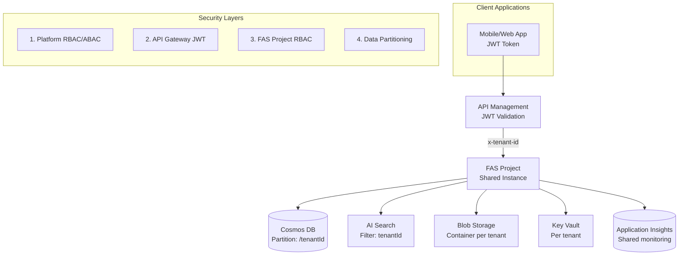
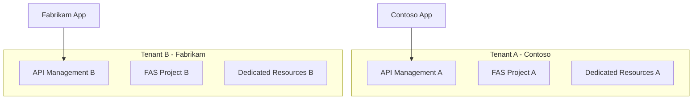

# Azure AI Foundry Agent Service - Multi-Tenant Architecture

[](https://opensource.org/licenses/MIT)
[](https://azure.microsoft.com/)
[](https://docs.microsoft.com/en-us/azure/azure-resource-manager/bicep/)

*Version 1.0 – June 20, 2025*

## 🎯 Overview

This repository provides comprehensive multi-tenant architecture implementations for **Azure AI Foundry Agent Service (FAS)**, supporting both **Pooled (Shared)** and **Silo (Dedicated)** deployment models. Each approach offers different levels of tenant isolation, security, and resource efficiency to meet varying customer requirements.

### 🏗️ Architecture Patterns

| Pattern | Description | Use Cases | Isolation Level |
|---------|-------------|-----------|----------------|
| **Pooled** | Shared resources with logical separation | Cost-efficient, standard compliance | Logical (RBAC/ABAC, Tags, Partition Keys) |
| **Silo** | Dedicated resources per tenant | Strict compliance, data sovereignty | Physical (Separate subscriptions/resource groups) |

## 📁 Repository Structure

```
📦 ai-foundry-agent-service-multitenant
├── 📂 docs/
│   └── 📂 specs/                          # Technical specifications
│       ├── 📄 pooled-infrastructure-spec-en.md    # Pooled infrastructure design
│       ├── 📄 pooled-application-spec-en.md       # Pooled application design
│       ├── 📄 security-guidelines-en.md           # Security best practices
│       ├── 📄 operations-procedures-en.md         # Operations & monitoring
│       └── 📄 *-ja.md                            # Japanese translations
├── 📂 pooled/                             # Pooled multi-tenant implementation
│   ├── 📄 README.md                       # Pooled architecture overview
│   ├── 📂 app/                            # Python FastAPI application
│   └── 📂 infra/                          # Bicep infrastructure templates
├── 📂 silo/                               # Silo multi-tenant implementation
│   ├── 📄 README.md                       # Silo architecture overview
│   ├── 📂 app/                            # Python FastAPI application
│   └── 📂 infra/                          # Bicep infrastructure templates
└── 📄 README.md                           # This file
```

## 🚀 Quick Start

### Prerequisites

- **Azure CLI** v2.50+
- **Azure subscription** with appropriate permissions
- **Python** 3.11+ (for application development)
- **Node.js** 18+ (for Bicep tooling)

### 1. Choose Your Architecture

#### 🏊 Pooled Architecture (Recommended for most scenarios)
```bash
cd pooled/
```
- **Cost-effective**: Shared infrastructure reduces operational overhead
- **Logical isolation**: RBAC/ABAC, partition keys, and tenant tagging
- **Scalable**: Single FAS project serving multiple tenants

#### 🏰 Silo Architecture (For strict compliance requirements)
```bash
cd silo/
```
- **Maximum isolation**: Dedicated resources per tenant
- **Compliance-ready**: Meets strict regulatory requirements
- **Data sovereignty**: Complete tenant data separation

### 2. Deploy Infrastructure

```bash
# Login to Azure
az login

# Set your subscription
az account set --subscription "your-subscription-id"

# Deploy infrastructure (from pooled/ or silo/ directory)
az deployment sub create \
  --location "Japan East" \
  --template-file infra/main.bicep \
  --parameters @infra/main.parameters.json
```

### 3. Deploy Application

```bash
# Install dependencies
pip install -r app/requirements.txt

# Configure environment
cp app/.env.example app/.env
# Edit app/.env with your Azure resource details

# Run locally
cd app/
uvicorn main:app --reload
```

## 🏛️ Architecture Overview

### Pooled Multi-Tenant Architecture



### Silo Multi-Tenant Architecture



## 🔐 Security Features

### Multi-Layer Security (Pooled)
1. **Platform Level**: Azure RBAC/ABAC with conditional access
2. **API Gateway**: JWT validation with tenant claim extraction
3. **FAS Project**: Built-in RBAC and metadata-based access control
4. **Data Layer**: Partition keys and tenant-specific containers

### Zero Trust Principles
- ✅ **Verify explicitly**: JWT-based authentication
- ✅ **Least privilege**: Granular RBAC assignments
- ✅ **Assume breach**: Continuous monitoring and audit logging

### Compliance Ready
- 🛡️ **Data encryption**: In-transit (TLS 1.2+) and at-rest (CMK)
- 📋 **Audit logging**: Comprehensive activity and diagnostic logs
- 🔍 **Monitoring**: Real-time security event detection

## 🛠️ Technology Stack

| Component | Technology | Purpose |
|-----------|------------|---------|
| **Infrastructure** | Azure Bicep | Infrastructure as Code |
| **Runtime** | Python 3.11+ | Application runtime |
| **Web Framework** | FastAPI | High-performance async API |
| **AI Service** | Azure AI Foundry Agent Service | Agent orchestration |
| **Database** | Azure Cosmos DB | Document storage with partitioning |
| **Search** | Azure AI Search | Vector and full-text search |
| **Storage** | Azure Blob Storage | File and asset storage |
| **Security** | Azure Key Vault | Secrets and certificate management |
| **API Gateway** | Azure API Management | Authentication and routing |
| **Monitoring** | Application Insights | Observability and diagnostics |

## 📊 Deployment Scenarios

### Development Environment
```bash
# Quick deployment for testing
az deployment sub create \
  --location "Japan East" \
  --template-file infra/main.bicep \
  --parameters environment=dev
```

### Production Environment
```bash
# Production deployment with high availability
az deployment sub create \
  --location "Japan East" \
  --template-file infra/main.bicep \
  --parameters environment=prod \
  --parameters enablePrivateEndpoints=true \
  --parameters enableZoneRedundancy=true
```

## 📚 Documentation

### Specifications
- 📋 [Pooled Infrastructure Specification](./docs/specs/pooled-infrastructure-spec-en.md)
- 🐍 [Pooled Application Specification](./docs/specs/pooled-application-spec-en.md)
- 🔒 [Security Guidelines](./docs/specs/security-guidelines-en.md)
- ⚡ [Operations & Procedures](./docs/specs/operations-procedures-en.md)

### Implementation Guides
- 🏊 [Pooled Architecture Guide](./pooled/README.md)
- 🏰 [Silo Architecture Guide](./silo/README.md)

## 🔧 Configuration

### Environment Variables

Create an `.env` file in the application directory:

```bash
# Azure Configuration
AZURE_SUBSCRIPTION_ID=your-subscription-id
AZURE_RESOURCE_GROUP=rg-fas-pooled-dev
AZURE_TENANT_ID=your-tenant-id

# FAS Configuration
FAS_PROJECT_NAME=fas-pooled-dev
FAS_ENDPOINT=https://your-fas-endpoint

# Cosmos DB
COSMOS_ENDPOINT=https://your-cosmos-account.documents.azure.com:443/
COSMOS_DATABASE=agents

# Azure AI Search
SEARCH_ENDPOINT=https://your-search-service.search.windows.net
SEARCH_INDEX=agents-index

# Blob Storage
STORAGE_ACCOUNT=your-storage-account
STORAGE_CONTAINER=agents-files

# Application Insights
APPINSIGHTS_INSTRUMENTATION_KEY=your-instrumentation-key

# Logging
LOG_LEVEL=INFO
```

## 🚀 Getting Started with Development

### 1. Local Development Setup

```bash
# Clone the repository
git clone <repository-url>
cd ai-foundry-agent-service-multitenant

# Choose architecture pattern
cd pooled/  # or silo/

# Create virtual environment
python -m venv .venv
source .venv/bin/activate  # On Windows: .venv\Scripts\activate

# Install dependencies
pip install -r app/requirements.txt

# Copy environment template
cp app/.env.example app/.env
```

### 2. Running Tests

```bash
# Unit tests
pytest app/tests/unit/

# Integration tests (requires Azure resources)
pytest app/tests/integration/

# Load tests
pytest app/tests/load/
```

### 3. Development Workflow

```bash
# Start development server
cd app/
uvicorn main:app --reload --host 0.0.0.0 --port 8000

# API documentation available at:
# http://localhost:8000/docs (Swagger UI)
# http://localhost:8000/redoc (ReDoc)
```

## 📈 Monitoring & Observability

### Application Insights Integration
- 📊 **Performance monitoring**: Request/response times and throughput
- 🐛 **Error tracking**: Exception logging and stack traces
- 📈 **Custom metrics**: Business-specific KPIs and tenant metrics
- 🔍 **Distributed tracing**: End-to-end request correlation

### Alerting & Notifications
- ⚠️ **Health monitoring**: Service availability and response time alerts
- 🔐 **Security alerts**: Anomalous access patterns and failed authentications
- 💰 **Cost monitoring**: Resource usage and billing threshold alerts

## 🤝 Contributing

We welcome contributions! Please see our [Contributing Guidelines](.github/CONTRIBUTING.md) for details.

### Development Process
1. Fork the repository
2. Create a feature branch (`git checkout -b feature/amazing-feature`)
3. Commit your changes (`git commit -m 'Add some amazing feature'`)
4. Push to the branch (`git push origin feature/amazing-feature`)
5. Open a Pull Request

## 📝 License

This project is licensed under the MIT License - see the [LICENSE](LICENSE) file for details.

## 🆘 Support

### Documentation
- 📖 [Azure AI Foundry Documentation](https://learn.microsoft.com/en-us/azure/ai-foundry/)
- 🤖 [Agent Service Concepts](https://learn.microsoft.com/en-us/azure/ai-foundry/agents/concepts/standard-agent-setup)

### Community
- 💬 [GitHub Discussions](../../discussions) - Ask questions and share ideas
- 🐛 [GitHub Issues](../../issues) - Report bugs and request features

### Enterprise Support
For enterprise support and custom implementation services, please contact your Microsoft representative.

---

**Built with ❤️ for the Azure AI community**

*This repository demonstrates best practices for implementing multi-tenant AI agent services on Azure, combining the power of Azure AI Foundry with enterprise-grade security and scalability.*
