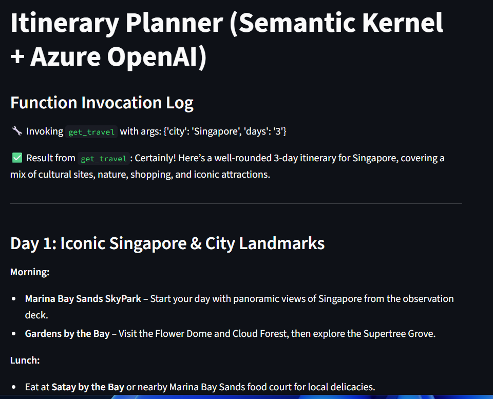

# Only run this section if you want to deploy the app within AKS via streamlit

## Prerequisites

1. AI foundry project
2. Azure OpenAI
2. gpt-4.1 and gpt-4.1-mini deployed
3. Azure container registry created
4. Grant acr pull and acr push permissions to mi-tenant-a and mi-tenant-b

## Grant your AKS cluster access to ACR

```bash
az aks update \
  --name <yourAKSCluster> \
  --resource-group <yourResourceGroup> \
  --attach-acr <acr-name>
```

## Grant your Managed Identities access to AI foundry project and AOAI

```bash
az role assignment create \
  --assignee $(az identity show --name mi-tenant-a --resource-group <RESOURCEGROUP> --query principalId -o tsv) \
  --role "Cognitive Services OpenAI User" \
  --scope /subscriptions/<SUBSCRIPTION_ID>/resourceGroups/<RESOURCEGROUP>/providers/Microsoft.CognitiveServices/accounts/<AOAI Name>
  
az role assignment create \
  --assignee $(az identity show --name mi-tenant-a --resource-group <RESOURCEGROUP> --query principalId -o tsv) \
  --role "Cognitive Services OpenAI User" \
  --scope /subscriptions/<SUBSCRIPTION_ID>/resourceGroups/<RESOURCEGROUP>/providers/Microsoft.CognitiveServices/accounts/<AI FOUNDRY ACCOUNT NAME>

az role assignment create \
  --assignee $(az identity show --name mi-tenant-b --resource-group <RESOURCEGROUP> --query principalId -o tsv) \
  --role "Cognitive Services OpenAI User" \
  --scope /subscriptions/<SUBSCRIPTION_ID>/resourceGroups/<RESOURCEGROUP>/providers/Microsoft.CognitiveServices/accounts/<AOAI Name>
  
az role assignment create \
  --assignee $(az identity show --name mi-tenant-b --resource-group <RESOURCEGROUP> --query principalId -o tsv) \
  --role "Cognitive Services OpenAI User" \
  --scope /subscriptions/<SUBSCRIPTION_ID>/resourceGroups/<RESOURCEGROUP>/providers/Microsoft.CognitiveServices/accounts/<AI FOUNDRY ACCOUNT NAME>
```
## Update tools.py with your own AI Project endpoint and blob storage account.

```yaml
project_client = AIProjectClient(
    endpoint="https://<YOUR_PROJECT>.services.ai.azure.com/api/projects/firstProject",
    credential=DefaultAzureCredential()
)
```

```yaml
blob_service_client = BlobServiceClient(
    account_url=<YOUR_BLOB_URL>,
    credential=WorkloadIdentityCredential()
)
```

## Create the docker image

Open a terminal in your local system. Substitute with your own repository.

```bash
az acr login --name <repo name>.azurecr.io
docker build docker/. -t <repo name>.azurecr.io/multitenant-ai:latest
docker push <repo name>.azurecr.io/multitenant-ai:latest
```

# Update the manifests file for both tenanta and tenantb with your repo name

```yaml
containers:
    - name: semantic-ui
    image: <repo_name>.azurecr.io/multitenant-ai:latest
```

# Deploy the manifest file

```bash
kubectl apply -f ./docker/manifests/tenanta/deployment.yaml -n tenant-a
kubectl apply -f ./docker/manifests/tenantb/deployment.yaml -n tenant-b
```

# Access the streamlit UI for tenant-a and tenant-b
Access your streamlit service for tenant-a on port 8501 and tenant-b on port 8502

```bash
kubectl port-forward svc/tenant-a-streamlit-service 8501:8501 -n tenant-a
kubectl port-forward svc/tenant-b-streamlit-service 8502:8501 -n tenant-b
```

Here is a sample command for you to type into the chat box. You can see the function invocation logs section to see which agent was called, which function was triggered and what the argurments specified are. Follow the prompt from the model to provide sample personal details (Do not provide your actual personal details) and see how the model selects which tenant to upload the finalized itinerary to.

```bash
plan me an itinerary to singapore for 3 days
```

