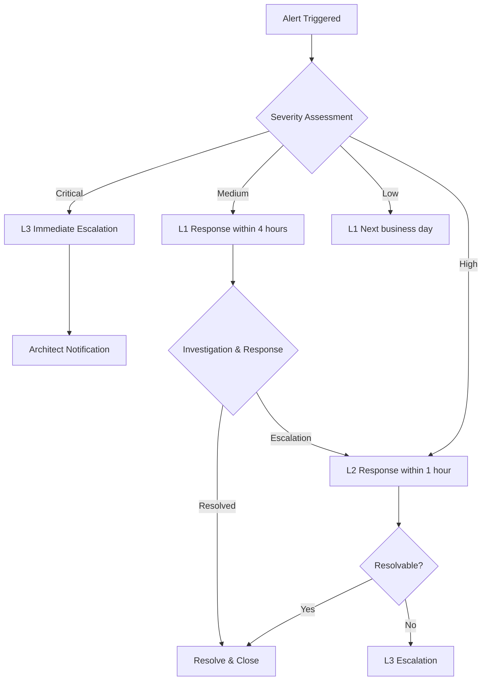

# Operations & Monitoring Procedures for Pooled Multi-Tenant Architecture

*Version 1.0 – 2025-06-20*

## 1. Overview

This document defines the operations and monitoring procedures for the Azure AI Foundry Agent Service (FAS) using a Pooled (shared) multi-tenant approach. It encompasses automated monitoring, alerting, and incident response procedures assuming 24/7 operations.

## 2. Operational Structure

### 2.1 Responsibility Matrix

| Role | Responsibilities | Working Hours | Escalation |
|------|------------------|---------------|------------|
| **L1 Support** | Basic monitoring, initial response | 24/7 | L2 Support |
| **L2 Support** | Technical investigation, recovery | Weekdays 9-18 | L3 Support |
| **L3 Support** | Deep analysis, development response | On-call | Architect |
| **SRE Team** | Infrastructure operations, optimization | Weekdays 9-18 | Infrastructure Lead |
| **Security Team** | Security monitoring, response | 24/7 | CISO |

### 2.2 On-Call Structure



## 3. Monitoring Strategy

### 3.1 Monitoring Layers

#### 3.1.1 Infrastructure Monitoring
- **Azure Monitor**: Resource health, metrics
- **Network Watcher**: Network connectivity
- **Azure Security Center**: Security posture

#### 3.1.2 Application Monitoring
- **Application Insights**: Performance, availability
- **Custom Metrics**: Business metrics
- **Distributed Tracing**: Request tracking

#### 3.1.3 Business Monitoring
- **Tenant-specific SLA**: Availability, response time
- **Usage Metrics**: API calls, data consumption
- **Cost Monitoring**: Resource usage costs

### 3.2 SLA Definitions

| Metric | SLA Target | Measurement Period | Alert Threshold |
|--------|------------|-------------------|-----------------|
| **Availability** | 99.9% | Monthly | < 99.95% |
| **Response Time** | < 2s (95th) | 5 minutes | > 3s |
| **Error Rate** | < 0.1% | 5 minutes | > 0.5% |
| **Tenant Isolation** | 100% | Real-time | > 0% |

## 4. Monitoring Dashboards

### 4.1 Operations Dashboard Configuration

#### 4.1.1 Main Dashboard
```json
{
  "dashboard": {
    "name": "AI Foundry Agents - Operations Overview",
    "widgets": [
      {
        "type": "metric",
        "title": "Overall System Health",
        "query": "Heartbeat | summarize avg(TimeGenerated) by Computer",
        "visualization": "singlestat"
      },
      {
        "type": "metric", 
        "title": "Request Rate (per minute)",
        "query": "requests | summarize count() by bin(timestamp, 1m)",
        "visualization": "timechart"
      },
      {
        "type": "metric",
        "title": "Error Rate by Tenant",
        "query": "requests | where resultCode >= 400 | summarize ErrorRate = count() * 100.0 / prev(count()) by tostring(customDimensions.tenantId)",
        "visualization": "table"
      },
      {
        "type": "metric",
        "title": "Response Time Distribution",
        "query": "requests | summarize percentiles(duration, 50, 90, 95, 99)",
        "visualization": "barchart"
      }
    ]
  }
}
```

#### 4.1.2 Tenant-specific Dashboard
```kql
// Tenant-specific performance monitoring
let TenantId = "contoso";
requests
| where customDimensions.tenantId == TenantId
| where timestamp > ago(1h)
| summarize 
    RequestCount = count(),
    AvgDuration = avg(duration),
    ErrorRate = countif(resultCode >= 400) * 100.0 / count(),
    P95Duration = percentile(duration, 95)
by bin(timestamp, 5m)
| render timechart

// Tenant-specific resource usage
let TenantId = "contoso";
customMetrics
| where name in ("cosmos_ru_consumption", "search_query_count", "storage_transactions")
| where customDimensions.tenantId == TenantId
| where timestamp > ago(24h)
| summarize Value = avg(value) by name, bin(timestamp, 1h)
| render timechart

// Tenant boundary check
traces
| where customDimensions has "tenantId"
| where message contains "boundary" or message contains "unauthorized"
| summarize ViolationCount = count() by 
    TenantId = tostring(customDimensions.tenantId),
    bin(timestamp, 1h)
| render timechart
```

### 4.2 Security Dashboard

#### 4.2.1 Security Metrics
```kql
// Authentication failure monitoring
SecurityEvent
| where EventID == 4625
| where TimeGenerated > ago(1h)
| summarize FailedLogins = count() by 
    Account = tolower(Account),
    TenantId = tostring(customDimensions.tenantId),
    bin(TimeGenerated, 5m)
| where FailedLogins > 5
| render timechart

// Abnormal API access patterns
requests
| where timestamp > ago(1h)
| summarize 
    RequestCount = count(),
    UniqueIPs = dcount(client_IP)
by 
    UserId = tostring(customDimensions.userId),
    TenantId = tostring(customDimensions.tenantId),
    bin(timestamp, 5m)
| where RequestCount > 100 or UniqueIPs > 10
| order by RequestCount desc

// Data access audit
AppTraces
| where Message contains "dataAccess"
| where TimeGenerated > ago(24h)
| extend 
    Operation = tostring(customDimensions.operation),
    DataClassification = tostring(customDimensions.dataClassification),
    TenantId = tostring(customDimensions.tenantId)
| summarize AccessCount = count() by Operation, DataClassification, TenantId
| render piechart
```

## 5. Alert Configuration

### 5.1 Critical Alerts

#### 5.1.1 System Availability
```json
{
  "alertRule": {
    "name": "SystemAvailabilityDrop",
    "description": "System availability below 99.95%",
    "severity": "Critical",
    "enabled": true,
    "query": "requests | where timestamp > ago(5m) | summarize SuccessRate = countif(resultCode < 400) * 100.0 / count()",
    "threshold": 99.95,
    "operator": "LessThan",
    "timeWindow": "PT5M",
    "evaluationFrequency": "PT1M",
    "actionGroups": [
      "oncall-critical",
      "sre-team",
      "management"
    ],
    "autoMitigation": false
  }
}
```

#### 5.1.2 Tenant Boundary Violation
```json
{
  "alertRule": {
    "name": "TenantBoundaryViolation",
    "description": "Tenant boundary violation detected",
    "severity": "Critical",
    "enabled": true,
    "query": "traces | where message contains 'boundary violation' or message contains 'unauthorized tenant access'",
    "threshold": 1,
    "operator": "GreaterThan",
    "timeWindow": "PT1M",
    "evaluationFrequency": "PT1M",
    "actionGroups": [
      "security-team",
      "oncall-critical"
    ],
    "autoMitigation": false
  }
}
```

#### 5.1.3 High Error Rate
```json
{
  "alertRule": {
    "name": "HighErrorRate",
    "description": "Error rate exceeds 5% for any tenant",
    "severity": "High",
    "enabled": true,
    "query": "requests | where timestamp > ago(5m) | summarize ErrorRate = countif(resultCode >= 400) * 100.0 / count() by tostring(customDimensions.tenantId) | where ErrorRate > 5",
    "threshold": 1,
    "operator": "GreaterThan",
    "timeWindow": "PT5M",
    "evaluationFrequency": "PT1M",
    "actionGroups": [
      "oncall-high",
      "tenant-admin"
    ],
    "autoMitigation": false
  }
}
```

### 5.2 Performance Alerts

#### 5.2.1 Response Time Degradation
```kql
// P95 response time monitoring
requests
| where timestamp > ago(5m)
| summarize P95Duration = percentile(duration, 95) by tostring(customDimensions.tenantId)
| where P95Duration > 3000  // 3 seconds
```

#### 5.2.2 Resource Usage
```kql
// Cosmos DB RU consumption monitoring
customMetrics
| where name == "cosmos_ru_consumption"
| where timestamp > ago(5m)
| summarize AvgRU = avg(value) by tostring(customDimensions.tenantId)
| where AvgRU > 8000  // 80% usage
```

## 6. Auto-Remediation Features

### 6.1 Auto-scaling

#### 6.1.1 Cosmos DB Auto-scale
```python
from azure.cosmos import CosmosClient
from azure.identity import DefaultAzureCredential
import logging

class CosmosAutoScaler:
    """Cosmos DB Auto-scaling"""
    
    def __init__(self, account_url: str, database_name: str):
        credential = DefaultAzureCredential()
        self.client = CosmosClient(account_url, credential)
        self.database = self.client.get_database_client(database_name)
        self.logger = logging.getLogger(__name__)
    
    def monitor_and_scale(self):
        """Monitor RU consumption and auto-scale"""
        containers = ["threads", "messages", "runs", "files"]
        
        for container_name in containers:
            container = self.database.get_container_client(container_name)
            
            # Get current throughput
            offer = container.read_offer()
            current_throughput = offer['content']['offerThroughput']
            
            # Check usage rate (last 5 minutes)
            usage_percent = self.get_ru_usage_percent(container_name)
            
            if usage_percent > 80:
                # Scale up
                new_throughput = min(current_throughput * 2, 20000)
                container.replace_throughput(new_throughput)
                self.logger.info(f"Scaled up {container_name} from {current_throughput} to {new_throughput} RU/s")
                
            elif usage_percent < 20 and current_throughput > 400:
                # Scale down
                new_throughput = max(current_throughput // 2, 400)
                container.replace_throughput(new_throughput)
                self.logger.info(f"Scaled down {container_name} from {current_throughput} to {new_throughput} RU/s")
    
    def get_ru_usage_percent(self, container_name: str) -> float:
        """Get RU usage percentage"""
        # Get metrics from Application Insights
        # In actual implementation, use Application Insights API
        return 50.0  # Placeholder
```

#### 6.1.2 Container Apps Auto-scale
```yaml
# Container Apps auto-scaling configuration
apiVersion: apps/v1
kind: Deployment
metadata:
  name: ai-foundry-agent-service
spec:
  replicas: 2
  selector:
    matchLabels:
      app: ai-foundry-agent-service
  template:
    spec:
      containers:
      - name: agent-service
        image: your-registry/agent-service:latest
        resources:
          requests:
            cpu: "0.25"
            memory: "0.5Gi"
          limits:
            cpu: "1.0"
            memory: "2.0Gi"
---
apiVersion: autoscaling/v2
kind: HorizontalPodAutoscaler
metadata:
  name: agent-service-hpa
spec:
  scaleTargetRef:
    apiVersion: apps/v1
    kind: Deployment
    name: ai-foundry-agent-service
  minReplicas: 2
  maxReplicas: 10
  metrics:
  - type: Resource
    resource:
      name: cpu
      target:
        type: Utilization
        averageUtilization: 70
  - type: Resource
    resource:
      name: memory
      target:
        type: Utilization
        averageUtilization: 80
```

### 6.2 Auto-Recovery Scripts

#### 6.2.1 Health Check & Recovery
```python
import asyncio
import aiohttp
import logging
from typing import Dict, List
from datetime import datetime, timedelta

class HealthCheckMonitor:
    """Health check and auto-recovery"""
    
    def __init__(self, endpoints: List[Dict[str, str]]):
        self.endpoints = endpoints
        self.logger = logging.getLogger(__name__)
        self.failed_checks = {}
    
    async def check_endpoint_health(self, endpoint: Dict[str, str]) -> bool:
        """Check endpoint health"""
        try:
            async with aiohttp.ClientSession() as session:
                async with session.get(
                    endpoint['url'] + '/health',
                    timeout=aiohttp.ClientTimeout(total=30)
                ) as response:
                    return response.status == 200
        except Exception as e:
            self.logger.error(f"Health check failed for {endpoint['name']}: {e}")
            return False
    
    async def monitor_health(self):
        """Continuous health monitoring"""
        while True:
            for endpoint in self.endpoints:
                is_healthy = await self.check_endpoint_health(endpoint)
                
                if not is_healthy:
                    await self.handle_unhealthy_endpoint(endpoint)
                else:
                    # If recovered
                    if endpoint['name'] in self.failed_checks:
                        self.logger.info(f"Endpoint {endpoint['name']} recovered")
                        del self.failed_checks[endpoint['name']]
            
            await asyncio.sleep(60)  # 1-minute interval
    
    async def handle_unhealthy_endpoint(self, endpoint: Dict[str, str]):
        """Handle unhealthy endpoint"""
        endpoint_name = endpoint['name']
        
        # Count failures
        if endpoint_name not in self.failed_checks:
            self.failed_checks[endpoint_name] = {
                'count': 1,
                'first_failure': datetime.utcnow()
            }
        else:
            self.failed_checks[endpoint_name]['count'] += 1
        
        failure_info = self.failed_checks[endpoint_name]
        
        # Attempt auto-recovery after 3 consecutive failures
        if failure_info['count'] >= 3:
            await self.attempt_auto_recovery(endpoint)
        
        # Escalate if failing for 10 minutes continuously
        if datetime.utcnow() - failure_info['first_failure'] > timedelta(minutes=10):
            await self.escalate_incident(endpoint, failure_info)
    
    async def attempt_auto_recovery(self, endpoint: Dict[str, str]):
        """Attempt auto-recovery"""
        self.logger.info(f"Attempting auto-recovery for {endpoint['name']}")
        
        recovery_actions = [
            self.restart_service,
            self.clear_cache,
            self.scale_up_resources
        ]
        
        for action in recovery_actions:
            try:
                success = await action(endpoint)
                if success:
                    self.logger.info(f"Auto-recovery successful for {endpoint['name']}")
                    return
            except Exception as e:
                self.logger.error(f"Recovery action failed: {e}")
        
        self.logger.error(f"All auto-recovery attempts failed for {endpoint['name']}")
    
    async def restart_service(self, endpoint: Dict[str, str]) -> bool:
        """Restart service"""
        # Container Apps restart implementation
        # Use Azure REST API or Azure CLI
        return False  # Placeholder
    
    async def clear_cache(self, endpoint: Dict[str, str]) -> bool:
        """Clear cache"""
        # Clear Redis or Application Cache
        return False  # Placeholder
    
    async def scale_up_resources(self, endpoint: Dict[str, str]) -> bool:
        """Scale up resources"""
        # Container Apps scale up
        return False  # Placeholder
    
    async def escalate_incident(self, endpoint: Dict[str, str], failure_info: Dict):
        """Escalate incident"""
        incident_data = {
            "title": f"Service {endpoint['name']} Unavailable",
            "description": f"Service has been unhealthy for {failure_info['count']} checks",
            "severity": "High",
            "endpoint": endpoint,
            "failure_duration": datetime.utcnow() - failure_info['first_failure']
        }
        
        # Notify incident management system
        await self.create_incident(incident_data)
    
    async def create_incident(self, incident_data: Dict):
        """Create incident"""
        # Create incident in ServiceNow, JIRA, or Azure DevOps
        self.logger.critical(f"Incident created: {incident_data}")
```

## 7. Capacity Planning

### 7.1 Resource Usage Prediction

#### 7.1.1 Prediction Model
```python
import pandas as pd
from sklearn.linear_model import LinearRegression
from sklearn.metrics import mean_absolute_error
import numpy as np
from datetime import datetime, timedelta

class CapacityPlanner:
    """Capacity planning and prediction"""
    
    def __init__(self):
        self.models = {}
        self.historical_data = {}
    
    def collect_historical_metrics(self, days: int = 30) -> Dict[str, pd.DataFrame]:
        """Collect historical metrics"""
        # Get metrics from Application Insights
        metrics = {
            'requests_per_minute': self.get_requests_metrics(days),
            'cosmos_ru_consumption': self.get_cosmos_metrics(days),
            'memory_usage': self.get_memory_metrics(days),
            'cpu_usage': self.get_cpu_metrics(days)
        }
        return metrics
    
    def train_prediction_models(self):
        """Train prediction models"""
        historical_data = self.collect_historical_metrics()
        
        for metric_name, data in historical_data.items():
            if len(data) < 7:  # Minimum 7 days of data required
                continue
            
            # Create features
            data['hour'] = data.index.hour
            data['day_of_week'] = data.index.dayofweek
            data['day_of_month'] = data.index.day
            
            X = data[['hour', 'day_of_week', 'day_of_month']].values
            y = data['value'].values
            
            # Train linear regression model
            model = LinearRegression()
            model.fit(X, y)
            
            self.models[metric_name] = model
            self.historical_data[metric_name] = data
    
    def predict_capacity_needs(self, days_ahead: int = 7) -> Dict[str, Dict]:
        """Predict capacity needs"""
        predictions = {}
        
        for metric_name, model in self.models.items():
            future_dates = pd.date_range(
                start=datetime.now(),
                periods=days_ahead * 24,  # Hourly
                freq='H'
            )
            
            # Create features
            future_features = np.array([
                [date.hour, date.dayofweek, date.day] 
                for date in future_dates
            ])
            
            # Execute prediction
            predicted_values = model.predict(future_features)
            
            predictions[metric_name] = {
                'dates': future_dates,
                'values': predicted_values,
                'max_predicted': np.max(predicted_values),
                'avg_predicted': np.mean(predicted_values)
            }
        
        return predictions
    
    def generate_capacity_recommendations(self) -> List[Dict]:
        """Generate capacity recommendations"""
        predictions = self.predict_capacity_needs()
        recommendations = []
        
        # Cosmos DB RU recommendations
        if 'cosmos_ru_consumption' in predictions:
            max_ru = predictions['cosmos_ru_consumption']['max_predicted']
            current_ru = self.get_current_cosmos_throughput()
            
            if max_ru > current_ru * 0.8:  # Predicted >80% usage
                recommended_ru = int(max_ru * 1.2)  # 20% buffer
                recommendations.append({
                    'service': 'Cosmos DB',
                    'current_capacity': current_ru,
                    'recommended_capacity': recommended_ru,
                    'reason': f'Predicted peak usage: {max_ru:.0f} RU/s',
                    'urgency': 'High' if max_ru > current_ru else 'Medium'
                })
        
        # Container Apps scale recommendations
        if 'requests_per_minute' in predictions:
            max_rpm = predictions['requests_per_minute']['max_predicted']
            current_instances = self.get_current_container_instances()
            
            # Assume 100 RPM per instance capacity
            required_instances = int(max_rpm / 100) + 1
            
            if required_instances > current_instances:
                recommendations.append({
                    'service': 'Container Apps',
                    'current_capacity': current_instances,
                    'recommended_capacity': required_instances,
                    'reason': f'Predicted peak: {max_rpm:.0f} RPM',
                    'urgency': 'Medium'
                })
        
        return recommendations
    
    def get_requests_metrics(self, days: int) -> pd.DataFrame:
        """Get request metrics"""
        # Placeholder implementation
        return pd.DataFrame()
    
    def get_cosmos_metrics(self, days: int) -> pd.DataFrame:
        """Get Cosmos DB metrics"""
        # Placeholder implementation
        return pd.DataFrame()
    
    def get_memory_metrics(self, days: int) -> pd.DataFrame:
        """Get memory metrics"""
        # Placeholder implementation
        return pd.DataFrame()
    
    def get_cpu_metrics(self, days: int) -> pd.DataFrame:
        """Get CPU metrics"""
        # Placeholder implementation
        return pd.DataFrame()
    
    def get_current_cosmos_throughput(self) -> int:
        """Get current Cosmos DB throughput"""
        # Placeholder implementation
        return 1000
    
    def get_current_container_instances(self) -> int:
        """Get current Container Apps instance count"""
        # Placeholder implementation
        return 2
```

### 7.2 Cost Optimization

#### 7.2.1 Cost Monitoring & Alerts
```kql
// Daily cost monitoring
Usage
| where TimeGenerated > ago(1d)
| where MeterId has "cosmos" or MeterId has "search" or MeterId has "storage"
| summarize TotalCost = sum(Quantity * UnitPrice) by 
    ServiceName = tostring(MeterCategory),
    TenantId = tostring(Tags.tenantId)
| order by TotalCost desc

// Budget exceeded alert
Usage
| where TimeGenerated > startofmonth(now())
| summarize MonthlySpend = sum(Quantity * UnitPrice) by TenantId = tostring(Tags.tenantId)
| join kind=inner (
    BudgetData
    | project TenantId, MonthlyBudget
) on TenantId
| where MonthlySpend > MonthlyBudget * 0.8  // Alert at 80% usage
| project TenantId, MonthlySpend, MonthlyBudget, UsagePercent = MonthlySpend / MonthlyBudget * 100
```

#### 7.2.2 Automated Optimization Scripts
```python
class CostOptimizer:
    """Cost optimization"""
    
    def __init__(self):
        self.recommendations = []
    
    def analyze_cosmos_usage(self) -> List[Dict]:
        """Analyze Cosmos DB usage"""
        recommendations = []
        
        # Detect low-usage containers
        low_usage_containers = self.find_low_usage_containers()
        
        for container in low_usage_containers:
            if container['usage_percent'] < 20:
                current_ru = container['provisioned_ru']
                recommended_ru = max(400, int(current_ru * 0.5))
                
                recommendations.append({
                    'service': 'Cosmos DB',
                    'container': container['name'],
                    'current_ru': current_ru,
                    'recommended_ru': recommended_ru,
                    'potential_savings': self.calculate_cosmos_savings(current_ru, recommended_ru),
                    'action': 'scale_down'
                })
        
        return recommendations
    
    def analyze_storage_usage(self) -> List[Dict]:
        """Analyze storage usage"""
        recommendations = []
        
        # Move infrequently accessed data to cool tier
        old_data = self.find_old_unused_data()
        
        for data in old_data:
            if data['last_access'] > 30:  # 30 days without access
                recommendations.append({
                    'service': 'Blob Storage',
                    'container': data['container'],
                    'size_gb': data['size_gb'],
                    'current_tier': 'Hot',
                    'recommended_tier': 'Cool',
                    'potential_savings': data['size_gb'] * 0.01,  # $0.01/GB difference
                    'action': 'change_tier'
                })
        
        return recommendations
    
    def implement_optimization(self, recommendation: Dict):
        """Implement optimization"""
        if recommendation['service'] == 'Cosmos DB' and recommendation['action'] == 'scale_down':
            self.scale_cosmos_container(
                recommendation['container'],
                recommendation['recommended_ru']
            )
        elif recommendation['service'] == 'Blob Storage' and recommendation['action'] == 'change_tier':
            self.change_blob_tier(
                recommendation['container'],
                recommendation['recommended_tier']
            )
    
    def find_low_usage_containers(self) -> List[Dict]:
        """Find low-usage containers"""
        # Placeholder implementation
        return []
    
    def find_old_unused_data(self) -> List[Dict]:
        """Find old unused data"""
        # Placeholder implementation
        return []
    
    def calculate_cosmos_savings(self, current_ru: int, new_ru: int) -> float:
        """Calculate Cosmos DB savings"""
        hourly_cost_per_100ru = 0.008  # $/hour
        hourly_savings = (current_ru - new_ru) / 100 * hourly_cost_per_100ru
        return hourly_savings * 24 * 30  # Monthly savings
    
    def scale_cosmos_container(self, container_name: str, new_ru: int):
        """Scale Cosmos DB container"""
        # Placeholder implementation
        pass
    
    def change_blob_tier(self, container_name: str, new_tier: str):
        """Change blob tier"""
        # Placeholder implementation
        pass
```

## 8. Backup & Disaster Recovery

### 8.1 Backup Strategy

#### 8.1.1 Data Backup
| Service | Backup Frequency | Retention Period | Recovery Time Objective (RTO) |
|---------|------------------|------------------|-------------------------------|
| **Cosmos DB** | Continuous | 30 days | < 4 hours |
| **AI Search** | Daily | 30 days | < 8 hours |
| **Blob Storage** | Real-time (GRS) | Unlimited | < 2 hours |
| **Key Vault** | Automatic | 90 days | < 1 hour |

#### 8.1.2 Configuration Backup
```bash
#!/bin/bash
# Infrastructure as Code backup

BACKUP_DATE=$(date +%Y%m%d_%H%M%S)
BACKUP_DIR="./backups/${BACKUP_DATE}"

# Backup Bicep templates
mkdir -p ${BACKUP_DIR}/infrastructure
cp -r ./infra/* ${BACKUP_DIR}/infrastructure/

# Backup configuration files
mkdir -p ${BACKUP_DIR}/config
cp -r ./config/* ${BACKUP_DIR}/config/

# Export Azure resource configuration
az group export --name rg-fas-pooled-prod --output-format json > ${BACKUP_DIR}/resource-group-config.json

# Export Key Vault secrets list (excluding values)
az keyvault secret list --vault-name kv-contoso-prod --query "[].{name:name,enabled:attributes.enabled}" > ${BACKUP_DIR}/keyvault-secrets-list.json

# Commit to Git repository
git add ${BACKUP_DIR}
git commit -m "Automated backup - ${BACKUP_DATE}"
git push origin backup-branch

echo "Backup completed: ${BACKUP_DIR}"
```

### 8.2 Disaster Recovery Procedures

#### 8.2.1 DR Execution Procedures
```python
import asyncio
import logging
from typing import Dict, List
from datetime import datetime

class DisasterRecoveryManager:
    """Disaster recovery management"""
    
    def __init__(self, dr_config: Dict):
        self.dr_config = dr_config
        self.logger = logging.getLogger(__name__)
        self.recovery_steps = []
    
    async def execute_disaster_recovery(self, disaster_type: str):
        """Execute disaster recovery"""
        self.logger.critical(f"Initiating disaster recovery for: {disaster_type}")
        
        recovery_plan = self.get_recovery_plan(disaster_type)
        
        for step in recovery_plan['steps']:
            try:
                await self.execute_recovery_step(step)
                self.recovery_steps.append({
                    'step': step['name'],
                    'status': 'completed',
                    'timestamp': datetime.utcnow()
                })
            except Exception as e:
                self.logger.error(f"Recovery step failed: {step['name']} - {e}")
                self.recovery_steps.append({
                    'step': step['name'],
                    'status': 'failed',
                    'error': str(e),
                    'timestamp': datetime.utcnow()
                })
                
                if step.get('critical', False):
                    raise Exception(f"Critical recovery step failed: {step['name']}")
    
    def get_recovery_plan(self, disaster_type: str) -> Dict:
        """Get recovery plan"""
        plans = {
            'region_outage': {
                'steps': [
                    {'name': 'validate_dr_region', 'function': 'validate_dr_region', 'critical': True},
                    {'name': 'failover_cosmos_db', 'function': 'failover_cosmos_db', 'critical': True},
                    {'name': 'restore_ai_search', 'function': 'restore_ai_search', 'critical': True},
                    {'name': 'deploy_container_apps', 'function': 'deploy_container_apps', 'critical': True},
                    {'name': 'update_dns_records', 'function': 'update_dns_records', 'critical': True},
                    {'name': 'validate_services', 'function': 'validate_services', 'critical': True},
                    {'name': 'notify_stakeholders', 'function': 'notify_stakeholders', 'critical': False}
                ]
            },
            'data_corruption': {
                'steps': [
                    {'name': 'isolate_corrupted_data', 'function': 'isolate_corrupted_data', 'critical': True},
                    {'name': 'restore_from_backup', 'function': 'restore_from_backup', 'critical': True},
                    {'name': 'validate_data_integrity', 'function': 'validate_data_integrity', 'critical': True},
                    {'name': 'resume_operations', 'function': 'resume_operations', 'critical': True}
                ]
            },
            'security_breach': {
                'steps': [
                    {'name': 'isolate_affected_systems', 'function': 'isolate_affected_systems', 'critical': True},
                    {'name': 'revoke_compromised_credentials', 'function': 'revoke_credentials', 'critical': True},
                    {'name': 'deploy_patched_systems', 'function': 'deploy_patched_systems', 'critical': True},
                    {'name': 'restore_from_clean_backup', 'function': 'restore_clean_backup', 'critical': True},
                    {'name': 'security_validation', 'function': 'security_validation', 'critical': True}
                ]
            }
        }
        
        return plans.get(disaster_type, {'steps': []})
    
    async def execute_recovery_step(self, step: Dict):
        """Execute recovery step"""
        function_name = step['function']
        
        if hasattr(self, function_name):
            function = getattr(self, function_name)
            await function()
        else:
            raise Exception(f"Recovery function not found: {function_name}")
    
    async def validate_dr_region(self):
        """Validate DR region"""
        # Check DR region availability
        pass
    
    async def failover_cosmos_db(self):
        """Cosmos DB failover"""
        # Execute Cosmos DB manual failover
        pass
    
    async def restore_ai_search(self):
        """Restore AI Search"""
        # Rebuild index
        pass
    
    async def deploy_container_apps(self):
        """Deploy Container Apps"""
        # Deploy application to DR region
        pass
    
    async def update_dns_records(self):
        """Update DNS records"""
        # Update Traffic Manager or DNS
        pass
    
    async def validate_services(self):
        """Validate services"""
        # Execute health checks for all services
        pass
    
    async def notify_stakeholders(self):
        """Notify stakeholders"""
        # Send recovery completion notification
        pass
```

## 9. Operations Automation

### 9.1 Scheduled Maintenance

#### 9.1.1 Automated Maintenance Scripts
```python
import schedule
import time
import logging
from datetime import datetime

class MaintenanceAutomation:
    """Scheduled maintenance automation"""
    
    def __init__(self):
        self.logger = logging.getLogger(__name__)
    
    def setup_maintenance_schedule(self):
        """Setup maintenance schedule"""
        
        # Daily maintenance (2 AM)
        schedule.every().day.at("02:00").do(self.daily_maintenance)
        
        # Weekly maintenance (Sunday 3 AM)
        schedule.every().sunday.at("03:00").do(self.weekly_maintenance)
        
        # Monthly maintenance (1st of month 4 AM)
        schedule.every().month.do(self.monthly_maintenance)
    
    def daily_maintenance(self):
        """Daily maintenance"""
        self.logger.info("Starting daily maintenance")
        
        tasks = [
            self.cleanup_old_logs,
            self.optimize_cosmos_indexing,
            self.validate_backup_integrity,
            self.update_security_patches,
            self.check_certificate_expiry
        ]
        
        for task in tasks:
            try:
                task()
                self.logger.info(f"Completed: {task.__name__}")
            except Exception as e:
                self.logger.error(f"Failed: {task.__name__} - {e}")
    
    def weekly_maintenance(self):
        """Weekly maintenance"""
        self.logger.info("Starting weekly maintenance")
        
        tasks = [
            self.analyze_performance_trends,
            self.update_capacity_recommendations,
            self.security_vulnerability_scan,
            self.backup_configuration_files
        ]
        
        for task in tasks:
            try:
                task()
                self.logger.info(f"Completed: {task.__name__}")
            except Exception as e:
                self.logger.error(f"Failed: {task.__name__} - {e}")
    
    def monthly_maintenance(self):
        """Monthly maintenance"""
        self.logger.info("Starting monthly maintenance")
        
        tasks = [
            self.generate_monthly_report,
            self.review_cost_optimization,
            self.update_disaster_recovery_plan,
            self.conduct_security_audit
        ]
        
        for task in tasks:
            try:
                task()
                self.logger.info(f"Completed: {task.__name__}")
            except Exception as e:
                self.logger.error(f"Failed: {task.__name__} - {e}")
    
    def cleanup_old_logs(self):
        """Clean up old logs"""
        # Delete logs older than 30 days
        pass
    
    def optimize_cosmos_indexing(self):
        """Optimize Cosmos DB indexing"""
        # Detect and remove unused indexes
        pass
    
    def validate_backup_integrity(self):
        """Validate backup integrity"""
        # Execute test restore from backup
        pass
    
    def update_security_patches(self):
        """Update security patches"""
        # Apply latest patches to container images
        pass
    
    def check_certificate_expiry(self):
        """Check certificate expiry"""
        # Check SSL certificate validity
        pass
    
    def analyze_performance_trends(self):
        """Analyze performance trends"""
        # Generate weekly performance report
        pass
    
    def update_capacity_recommendations(self):
        """Update capacity recommendations"""
        # Update capacity planning
        pass
    
    def security_vulnerability_scan(self):
        """Security vulnerability scan"""
        # Execute automated vulnerability scan
        pass
    
    def backup_configuration_files(self):
        """Backup configuration files"""
        # Backup infrastructure configuration
        pass
    
    def generate_monthly_report(self):
        """Generate monthly report"""
        # Generate SLA achievement, cost, security reports
        pass
    
    def review_cost_optimization(self):
        """Review cost optimization"""
        # Monthly cost analysis and optimization recommendations
        pass
    
    def update_disaster_recovery_plan(self):
        """Update disaster recovery plan"""
        # Regular review of DR plan
        pass
    
    def conduct_security_audit(self):
        """Conduct security audit"""
        # Monthly security audit
        pass
    
    def run_scheduler(self):
        """Run scheduler"""
        self.logger.info("Maintenance scheduler started")
        
        while True:
            schedule.run_pending()
            time.sleep(60)  # Check every minute
```

### 9.2 CI/CD Pipeline

#### 9.2.1 Deployment Pipeline
```yaml
# Azure DevOps Pipeline
trigger:
  branches:
    include:
    - main
    - develop

variables:
  azureSubscription: 'Azure-Subscription'
  resourceGroupName: 'rg-fas-pooled-$(environment)'
  containerRegistry: 'acr-fas-pooled.azurecr.io'

stages:
- stage: Build
  jobs:
  - job: BuildApplication
    steps:
    - task: Docker@2
      displayName: 'Build and Push Docker Image'
      inputs:
        containerRegistry: $(containerRegistry)
        repository: 'ai-foundry-agent-service'
        command: 'buildAndPush'
        Dockerfile: 'Dockerfile'
        tags: |
          $(Build.BuildId)
          latest

    - task: AzureCLI@2
      displayName: 'Security Scan'
      inputs:
        azureSubscription: $(azureSubscription)
        scriptType: 'bash'
        scriptLocation: 'inlineScript'
        inlineScript: |
          # Container security scan
          docker run --rm -v /var/run/docker.sock:/var/run/docker.sock \
            aquasec/trivy image $(containerRegistry)/ai-foundry-agent-service:$(Build.BuildId)

- stage: Test
  dependsOn: Build
  jobs:
  - job: SecurityTests
    steps:
    - task: PythonScript@0
      displayName: 'Run Security Tests'
      inputs:
        scriptSource: 'filePath'
        scriptPath: 'tests/security/run_security_tests.py'

  - job: IntegrationTests
    steps:
    - task: PythonScript@0
      displayName: 'Run Integration Tests'
      inputs:
        scriptSource: 'filePath'
        scriptPath: 'tests/integration/run_integration_tests.py'

- stage: Deploy
  dependsOn: Test
  condition: and(succeeded(), eq(variables['Build.SourceBranch'], 'refs/heads/main'))
  jobs:
  - deployment: DeployToProduction
    environment: 'production'
    strategy:
      runOnce:
        deploy:
          steps:
          - task: AzureResourceManagerTemplateDeployment@3
            displayName: 'Deploy Infrastructure'
            inputs:
              deploymentScope: 'Resource Group'
              azureResourceManagerConnection: $(azureSubscription)
              subscriptionId: $(subscriptionId)
              action: 'Create Or Update Resource Group'
              resourceGroupName: $(resourceGroupName)
              location: 'Japan East'
              templateLocation: 'Linked artifact'
              csmFile: 'infra/main.bicep'
              csmParametersFile: 'infra/main.parameters.prod.json'

          - task: AzureContainerApps@1
            displayName: 'Deploy Application'
            inputs:
              azureSubscription: $(azureSubscription)
              containerAppName: 'ca-ai-foundry-agent-service'
              resourceGroup: $(resourceGroupName)
              imageToDeploy: '$(containerRegistry)/ai-foundry-agent-service:$(Build.BuildId)'

          - task: AzureCLI@2
            displayName: 'Post-Deployment Validation'
            inputs:
              azureSubscription: $(azureSubscription)
              scriptType: 'bash'
              scriptLocation: 'inlineScript'
              inlineScript: |
                # Health check
                curl -f https://api-prod.example.com/health || exit 1
                
                # Smoke tests
                python tests/smoke/smoke_tests.py
```

## 10. Reporting

### 10.1 SLA Reports

#### 10.1.1 Monthly SLA Report
```kql
// Generate monthly SLA report
let StartTime = startofmonth(now());
let EndTime = now();

let AvailabilityData = requests
| where timestamp between (StartTime .. EndTime)
| summarize 
    TotalRequests = count(),
    SuccessfulRequests = countif(resultCode < 400),
    FailedRequests = countif(resultCode >= 400)
by TenantId = tostring(customDimensions.tenantId)
| extend AvailabilityPercent = round(SuccessfulRequests * 100.0 / TotalRequests, 3);

let PerformanceData = requests
| where timestamp between (StartTime .. EndTime)
| where resultCode < 400
| summarize 
    AvgResponseTime = avg(duration),
    P95ResponseTime = percentile(duration, 95),
    P99ResponseTime = percentile(duration, 99)
by TenantId = tostring(customDimensions.tenantId);

AvailabilityData
| join kind=inner PerformanceData on TenantId
| project 
    TenantId,
    AvailabilityPercent,
    SLAMet = iff(AvailabilityPercent >= 99.9, "✓", "✗"),
    AvgResponseTime = round(AvgResponseTime, 2),
    P95ResponseTime = round(P95ResponseTime, 2),
    P99ResponseTime = round(P99ResponseTime, 2),
    TotalRequests,
    FailedRequests
| order by TenantId asc
```

### 10.2 Automated Operations Report Generation

#### 10.2.1 Report Generation Script
```python
import pandas as pd
import matplotlib.pyplot as plt
from datetime import datetime, timedelta
import smtplib
from email.mime.multipart import MIMEMultipart
from email.mime.text import MIMEText
from email.mime.image import MIMEImage

class OperationalReportGenerator:
    """Automated operations report generation"""
    
    def __init__(self, app_insights_client):
        self.ai_client = app_insights_client
    
    def generate_monthly_report(self, year: int, month: int):
        """Generate monthly operations report"""
        start_date = datetime(year, month, 1)
        end_date = (start_date + timedelta(days=32)).replace(day=1) - timedelta(days=1)
        
        report_data = {
            'period': f"{year}-{month:02d}",
            'sla_metrics': self.get_sla_metrics(start_date, end_date),
            'performance_metrics': self.get_performance_metrics(start_date, end_date),
            'security_metrics': self.get_security_metrics(start_date, end_date),
            'cost_metrics': self.get_cost_metrics(start_date, end_date),
            'incidents': self.get_incidents(start_date, end_date)
        }
        
        # Generate HTML report
        html_report = self.generate_html_report(report_data)
        
        # Generate PDF report
        pdf_report = self.generate_pdf_report(report_data)
        
        # Send to stakeholders
        self.send_report_email(html_report, pdf_report, report_data['period'])
        
        return report_data
    
    def get_sla_metrics(self, start_date: datetime, end_date: datetime) -> dict:
        """Get SLA metrics"""
        # Get SLA data with KQL query
        query = f"""
        requests
        | where timestamp between (datetime({start_date.isoformat()}) .. datetime({end_date.isoformat()}))
        | summarize 
            TotalRequests = count(),
            SuccessfulRequests = countif(resultCode < 400),
            AvgDuration = avg(duration),
            P95Duration = percentile(duration, 95)
        by TenantId = tostring(customDimensions.tenantId)
        | extend AvailabilityPercent = round(SuccessfulRequests * 100.0 / TotalRequests, 3)
        """
        
        # Placeholder implementation
        return {
            'overall_availability': 99.95,
            'tenant_availability': {
                'contoso': 99.97,
                'fabrikam': 99.93
            },
            'sla_breaches': 0
        }
    
    def get_performance_metrics(self, start_date: datetime, end_date: datetime) -> dict:
        """Get performance metrics"""
        return {
            'avg_response_time': 1.2,
            'p95_response_time': 2.8,
            'p99_response_time': 5.1,
            'throughput_rpm': 1250
        }
    
    def get_security_metrics(self, start_date: datetime, end_date: datetime) -> dict:
        """Get security metrics"""
        return {
            'failed_authentications': 127,
            'tenant_boundary_violations': 0,
            'security_alerts': 3,
            'vulnerability_scans': 30
        }
    
    def get_cost_metrics(self, start_date: datetime, end_date: datetime) -> dict:
        """Get cost metrics"""
        return {
            'total_cost': 2850.30,
            'cost_per_tenant': {
                'contoso': 1420.15,
                'fabrikam': 1430.15
            },
            'cost_optimization_savings': 385.50
        }
    
    def get_incidents(self, start_date: datetime, end_date: datetime) -> list:
        """Get incident information"""
        return [
            {
                'id': 'INC-2024-001',
                'title': 'Cosmos DB High Latency',
                'severity': 'Medium',
                'duration_minutes': 45,
                'affected_tenants': ['contoso']
            }
        ]
    
    def generate_html_report(self, report_data: dict) -> str:
        """Generate HTML report"""
        html_template = """
        <!DOCTYPE html>
        <html>
        <head>
            <title>AI Foundry Agents - Monthly Operations Report</title>
            <style>
                body { font-family: Arial, sans-serif; margin: 40px; }
                .header { background-color: #0078d4; color: white; padding: 20px; }
                .section { margin: 20px 0; }
                .metric { display: inline-block; margin: 10px; padding: 15px; background-color: #f5f5f5; border-radius: 5px; }
                .sla-met { color: green; font-weight: bold; }
                .sla-missed { color: red; font-weight: bold; }
                table { width: 100%; border-collapse: collapse; }
                th, td { border: 1px solid #ddd; padding: 8px; text-align: left; }
                th { background-color: #f2f2f2; }
            </style>
        </head>
        <body>
            <div class="header">
                <h1>AI Foundry Agents - Monthly Operations Report</h1>
                <p>Report Period: {period}</p>
            </div>
            
            <div class="section">
                <h2>SLA Summary</h2>
                <div class="metric">
                    <h3>Overall Availability</h3>
                    <p class="sla-met">{overall_availability}%</p>
                </div>
                <div class="metric">
                    <h3>SLA Breaches</h3>
                    <p>{sla_breaches}</p>
                </div>
            </div>
            
            <div class="section">
                <h2>Performance Metrics</h2>
                <table>
                    <tr>
                        <th>Metric</th>
                        <th>Value</th>
                        <th>Target</th>
                        <th>Status</th>
                    </tr>
                    <tr>
                        <td>Average Response Time</td>
                        <td>{avg_response_time}s</td>
                        <td>&lt; 2s</td>
                        <td class="sla-met">✓</td>
                    </tr>
                    <tr>
                        <td>95th Percentile Response Time</td>
                        <td>{p95_response_time}s</td>
                        <td>&lt; 3s</td>
                        <td class="sla-met">✓</td>
                    </tr>
                </table>
            </div>
            
            <div class="section">
                <h2>Security Summary</h2>
                <p>Failed Authentications: {failed_authentications}</p>
                <p>Tenant Boundary Violations: {tenant_boundary_violations}</p>
                <p>Security Alerts: {security_alerts}</p>
            </div>
            
            <div class="section">
                <h2>Cost Summary</h2>
                <p>Total Monthly Cost: ${total_cost}</p>
                <p>Cost Optimization Savings: ${cost_optimization_savings}</p>
            </div>
        </body>
        </html>
        """.format(
            period=report_data['period'],
            overall_availability=report_data['sla_metrics']['overall_availability'],
            sla_breaches=report_data['sla_metrics']['sla_breaches'],
            avg_response_time=report_data['performance_metrics']['avg_response_time'],
            p95_response_time=report_data['performance_metrics']['p95_response_time'],
            failed_authentications=report_data['security_metrics']['failed_authentications'],
            tenant_boundary_violations=report_data['security_metrics']['tenant_boundary_violations'],
            security_alerts=report_data['security_metrics']['security_alerts'],
            total_cost=report_data['cost_metrics']['total_cost'],
            cost_optimization_savings=report_data['cost_metrics']['cost_optimization_savings']
        )
        
        return html_template
    
    def generate_pdf_report(self, report_data: dict) -> bytes:
        """Generate PDF report"""
        # PDF generation implementation (using weasyprint etc.)
        return b"PDF content placeholder"
    
    def send_report_email(self, html_report: str, pdf_report: bytes, period: str):
        """Send report email"""
        recipients = [
            'operations@example.com',
            'management@example.com',
            'sre-team@example.com'
        ]
        
        msg = MIMEMultipart()
        msg['From'] = 'ai-foundry-ops@example.com'
        msg['To'] = ', '.join(recipients)
        msg['Subject'] = f'AI Foundry Agents - Monthly Operations Report ({period})'
        
        # HTML body
        msg.attach(MIMEText(html_report, 'html'))
        
        # PDF attachment
        pdf_attachment = MIMEImage(pdf_report)
        pdf_attachment.add_header('Content-Disposition', f'attachment; filename="operations-report-{period}.pdf"')
        msg.attach(pdf_attachment)
        
        # Send email (actual implementation requires SMTP configuration)
        # smtp_server = smtplib.SMTP('smtp.example.com', 587)
        # smtp_server.send_message(msg)
```

## 11. Related Documents

- [Pooled Infrastructure Specification](./pooled-infrastructure-spec.md)
- [Pooled Application Specification](./pooled-application-spec.md)
- [Security & Compliance Guidelines](./security-guidelines.md)
- [Incident Response Playbook](./incident-response-playbook.md)
- [Runbook Collection](./runbooks/)
- [API Documentation](./api-documentation.md)
