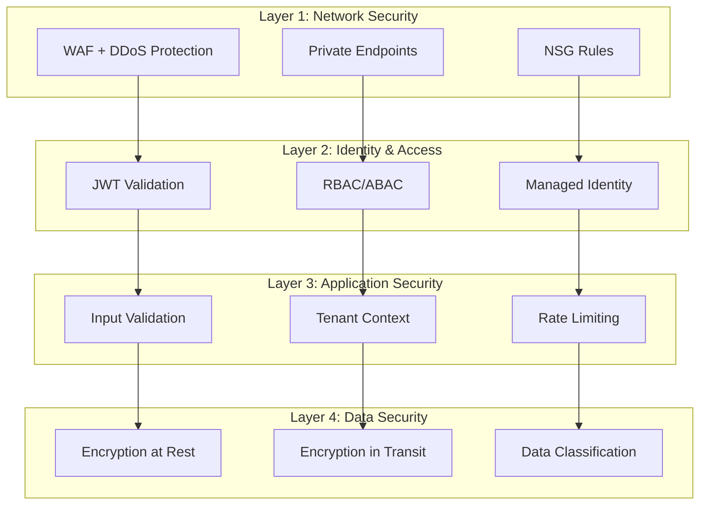

# Security & Compliance Guidelines for Pooled Multi-Tenant Architecture

*Version 1.0 – 2025-06-20*

## 1. Overview

This document defines comprehensive security and compliance requirements for the Pooled multi-tenant approach of Azure AI Foundry Agent Service (FAS). It prioritizes multi-layered defense based on Zero Trust principles and ensuring data sovereignty.

## 2. Security Architecture Principles

### 2.1 Zero Trust Principles
- **Never Trust, Always Verify**: Verify all access requests
- **Least Privilege Access**: Grant minimum necessary permissions
- **Assume Breach**: Design defense assuming compromise
- **Verify Explicitly**: Explicit authentication and authorization

### 2.2 Multi-Layered Defense Strategy



## 3. Authentication & Authorization Framework

### 3.1 JWT Token Specification

#### 3.1.1 Token Structure
```json
{
  "header": {
    "alg": "RS256",
    "typ": "JWT",
    "kid": "key-id"
  },
  "payload": {
    "iss": "https://sts.windows.net/{tenant-id}/",
    "aud": "api://ai-foundry-agents",
    "sub": "user-object-id",
    "extension_tenantId": "contoso",
    "roles": ["agent.user", "agent.admin"],
    "email": "user@contoso.com",
    "name": "John Doe",
    "iat": 1640995200,
    "exp": 1641001200,
    "nbf": 1640995200
  }
}
```

#### 3.1.2 Validation Requirements
1. **Signature Verification**: Confirm signature using RSA256 algorithm
2. **Issuer Validation**: Validate `iss` claim validity
3. **Audience Validation**: Verify `aud` claim matches service identifier
4. **Expiration Check**: Validate expiration using `exp` claim
5. **Tenant Validation**: Confirm existence and validity of `extension_tenantId`

### 3.2 RBAC/ABAC Implementation

#### 3.2.1 Role Definition
```json
{
  "roles": {
    "agent.admin": {
      "permissions": [
        "agent.create",
        "agent.read",
        "agent.update", 
        "agent.delete",
        "thread.create",
        "thread.read",
        "thread.update",
        "thread.delete"
      ],
      "conditions": [
        "@Resource.tag.tenantId == @Principal.extension_tenantId"
      ]
    },
    "agent.user": {
      "permissions": [
        "agent.read",
        "thread.create",
        "thread.read",
        "message.create",
        "message.read"
      ],
      "conditions": [
        "@Resource.tag.tenantId == @Principal.extension_tenantId"
      ]
    }
  }
}
```

#### 3.2.2 Conditional Access
```python
# ABAC condition evaluation example
def evaluate_abac_condition(principal, resource, action):
    """ABAC condition evaluation"""
    
    # Tenant boundary check
    principal_tenant = principal.get("extension_tenantId")
    resource_tenant = resource.get("tenantId") or resource.get("metadata", {}).get("tenantId")
    
    if principal_tenant != resource_tenant:
        return False
    
    # Role-based permission check
    required_permission = f"{resource.type}.{action}"
    user_roles = principal.get("roles", [])
    
    for role in user_roles:
        role_permissions = ROLE_PERMISSIONS.get(role, [])
        if required_permission in role_permissions:
            return True
    
    return False
```

## 4. Data Security

### 4.1 Encryption Requirements

#### 4.1.1 Encryption at Rest
| Service | Encryption Method | Key Management |
|---------|-------------------|----------------|
| **Cosmos DB** | AES-256 | Microsoft Managed Key (Recommended: CMK) |
| **Azure Storage** | AES-256 | Customer Managed Key (CMK) |
| **AI Search** | AES-256 | Microsoft Managed Key |
| **Key Vault** | HSM-backed | Hardware Security Module |

#### 4.1.2 Encryption in Transit
- **TLS 1.2 or higher**: Enforced for all communications
- **Certificate Pinning**: Implemented at API Gateway level
- **Perfect Forward Secrecy**: Use of key exchange algorithms

#### 4.1.3 Encryption Implementation Example
```python
from azure.keyvault.secrets import SecretClient
from azure.identity import DefaultAzureCredential
from cryptography.fernet import Fernet
import base64

class DataEncryption:
    """Data encryption service"""
    
    def __init__(self, keyvault_url: str):
        credential = DefaultAzureCredential()
        self.kv_client = SecretClient(vault_url=keyvault_url, credential=credential)
        self._encryption_key = None
    
    def get_encryption_key(self, tenant_id: str) -> bytes:
        """Get tenant-specific encryption key"""
        secret_name = f"{tenant_id}-encryption-key"
        
        try:
            secret = self.kv_client.get_secret(secret_name)
            return base64.b64decode(secret.value)
        except Exception:
            # Create new key if it doesn't exist
            new_key = Fernet.generate_key()
            self.kv_client.set_secret(secret_name, base64.b64encode(new_key).decode())
            return new_key
    
    def encrypt_sensitive_data(self, data: str, tenant_id: str) -> str:
        """Encrypt sensitive data"""
        key = self.get_encryption_key(tenant_id)
        fernet = Fernet(key)
        encrypted_data = fernet.encrypt(data.encode())
        return base64.b64encode(encrypted_data).decode()
    
    def decrypt_sensitive_data(self, encrypted_data: str, tenant_id: str) -> str:
        """Decrypt sensitive data"""
        key = self.get_encryption_key(tenant_id)
        fernet = Fernet(key)
        decoded_data = base64.b64decode(encrypted_data)
        decrypted_data = fernet.decrypt(decoded_data)
        return decrypted_data.decode()
```

### 4.2 Data Classification & Labeling

#### 4.2.1 Classification Levels
1. **Public**: Public information (no restrictions)
2. **Internal**: Internal information (company limited)
3. **Confidential**: Confidential information (limited access)
4. **Restricted**: Top secret information (minimum privileges)

#### 4.2.2 Labeling Implementation
```python
from enum import Enum
from typing import Dict, Any

class DataClassification(Enum):
    PUBLIC = "public"
    INTERNAL = "internal"
    CONFIDENTIAL = "confidential"
    RESTRICTED = "restricted"

class DataClassifier:
    """Data classification service"""
    
    CLASSIFICATION_RULES = {
        # PII data
        "email": DataClassification.CONFIDENTIAL,
        "phone": DataClassification.CONFIDENTIAL,
        "ssn": DataClassification.RESTRICTED,
        "credit_card": DataClassification.RESTRICTED,
        
        # Business data
        "financial": DataClassification.CONFIDENTIAL,
        "legal": DataClassification.RESTRICTED,
        "hr": DataClassification.CONFIDENTIAL,
        
        # Technical data
        "logs": DataClassification.INTERNAL,
        "metrics": DataClassification.INTERNAL,
        "config": DataClassification.CONFIDENTIAL
    }
    
    @staticmethod
    def classify_data(data: Dict[str, Any], context: str = None) -> DataClassification:
        """Execute data classification"""
        
        # Context-based classification
        if context and context in DataClassifier.CLASSIFICATION_RULES:
            return DataClassifier.CLASSIFICATION_RULES[context]
        
        # Content-based classification
        classification = DataClassification.PUBLIC
        
        for key, value in data.items():
            key_lower = key.lower()
            
            # Field name-based determination
            for pattern, level in DataClassifier.CLASSIFICATION_RULES.items():
                if pattern in key_lower:
                    if level.value == "restricted":
                        return DataClassification.RESTRICTED
                    elif level.value == "confidential" and classification != DataClassification.RESTRICTED:
                        classification = DataClassification.CONFIDENTIAL
                    elif level.value == "internal" and classification == DataClassification.PUBLIC:
                        classification = DataClassification.INTERNAL
        
        return classification
    
    @staticmethod
    def apply_data_protection(data: Dict[str, Any], classification: DataClassification, tenant_id: str) -> Dict[str, Any]:
        """Apply data protection based on classification level"""
        
        if classification in [DataClassification.CONFIDENTIAL, DataClassification.RESTRICTED]:
            # Encrypt confidential data
            encryptor = DataEncryption(f"https://kv-{tenant_id}.vault.azure.net/")
            
            for key, value in data.items():
                if isinstance(value, str) and len(value) > 0:
                    data[key] = encryptor.encrypt_sensitive_data(value, tenant_id)
        
        # Add classification information to metadata
        data["_dataClassification"] = classification.value
        data["_protectionApplied"] = True
        
        return data
```

## 5. Network Security

### 5.1 Web Application Firewall (WAF)

#### 5.1.1 OWASP Top 10 Protection
```json
{
  "wafRules": {
    "sqlInjection": {
      "enabled": true,
      "action": "Block",
      "anomalyScoring": true
    },
    "crossSiteScripting": {
      "enabled": true,
      "action": "Block",
      "anomalyScoring": true
    },
    "remoteFileInclusion": {
      "enabled": true,
      "action": "Block"
    },
    "remoteCodeExecution": {
      "enabled": true,
      "action": "Block"
    },
    "phpInjection": {
      "enabled": true,
      "action": "Block"
    },
    "javaAttacks": {
      "enabled": true,
      "action": "Block"
    },
    "sessionFixation": {
      "enabled": true,
      "action": "Block"
    }
  },
  "customRules": [
    {
      "name": "RateLimitPerTenant",
      "priority": 100,
      "ruleType": "RateLimitRule",
      "rateLimitDurationInMinutes": 1,
      "rateLimitThreshold": 100,
      "matchConditions": [
        {
          "matchVariables": [
            {
              "variableName": "RequestHeaders",
              "selector": "x-tenant-id"
            }
          ],
          "operator": "Any"
        }
      ],
      "action": "Block"
    }
  ]
}
```

#### 5.1.2 DDoS Protection
```bicep
// DDoS Protection Plan
resource ddosProtection 'Microsoft.Network/ddosProtectionPlans@2023-09-01' = {
  name: 'ddos-${projectName}-${environment}'
  location: location
  properties: {}
  tags: {
    purpose: 'DDoS Protection'
    criticality: 'High'
  }
}

// Application Gateway with WAF
resource applicationGateway 'Microsoft.Network/applicationGateways@2023-09-01' = {
  name: 'agw-${projectName}-${environment}'
  location: location
  properties: {
    sku: {
      name: 'WAF_v2'
      tier: 'WAF_v2'
      capacity: 2
    }
    webApplicationFirewallConfiguration: {
      enabled: true
      firewallMode: 'Prevention'
      ruleSetType: 'OWASP'
      ruleSetVersion: '3.2'
      requestBodyCheck: true
      maxRequestBodySizeInKb: 128
      fileUploadLimitInMb: 100
    }
    gatewayIPConfigurations: [
      {
        name: 'appGatewayIpConfig'
        properties: {
          subnet: {
            id: applicationGatewaySubnet.id
          }
        }
      }
    ]
  }
}
```

### 5.2 Private Endpoints

#### 5.2.1 Private Endpoint Configuration
```bicep
// Private Endpoint for Cosmos DB
resource cosmosPrivateEndpoint 'Microsoft.Network/privateEndpoints@2023-09-01' = {
  name: 'pe-cosmos-${projectName}-${environment}'
  location: location
  properties: {
    subnet: {
      id: privateEndpointSubnet.id
    }
    privateLinkServiceConnections: [
      {
        name: 'cosmos-connection'
        properties: {
          privateLinkServiceId: cosmosAccount.id
          groupIds: ['Sql']
        }
      }
    ]
  }
}

// Private DNS Zone
resource cosmosDnsZone 'Microsoft.Network/privateDnsZones@2020-06-01' = {
  name: 'privatelink.documents.azure.com'
  location: 'global'
}

// DNS Zone Link
resource cosmosDnsZoneLink 'Microsoft.Network/privateDnsZones/virtualNetworkLinks@2020-06-01' = {
  parent: cosmosDnsZone
  name: 'cosmos-dns-link'
  location: 'global'
  properties: {
    registrationEnabled: false
    virtualNetwork: {
      id: virtualNetwork.id
    }
  }
}
```

## 6. Audit & Compliance

### 6.1 Audit Log Requirements

#### 6.1.1 Required Log Events
1. **Authentication Events**: Login success/failure
2. **Authorization Events**: Access granted/denied
3. **Data Access**: CRUD operations
4. **Configuration Changes**: System configuration changes
5. **Security Events**: Anomaly detection

#### 6.1.2 Log Implementation Example
```python
import logging
import json
from datetime import datetime
from typing import Dict, Any
from core.tenant import TenantContext

class SecurityAuditLogger:
    """Security audit logger"""
    
    def __init__(self):
        self.logger = logging.getLogger("security.audit")
    
    def log_authentication_event(self, user_id: str, tenant_id: str, success: bool, details: Dict[str, Any] = None):
        """Log authentication event"""
        event = {
            "eventType": "authentication",
            "timestamp": datetime.utcnow().isoformat(),
            "userId": user_id,
            "tenantId": tenant_id,
            "success": success,
            "details": details or {}
        }
        
        if success:
            self.logger.info(f"Authentication successful: {json.dumps(event)}")
        else:
            self.logger.warning(f"Authentication failed: {json.dumps(event)}")
    
    def log_authorization_event(self, user_id: str, resource: str, action: str, granted: bool, reason: str = None):
        """Log authorization event"""
        tenant_id = TenantContext.get_tenant()
        
        event = {
            "eventType": "authorization",
            "timestamp": datetime.utcnow().isoformat(),
            "userId": user_id,
            "tenantId": tenant_id,
            "resource": resource,
            "action": action,
            "granted": granted,
            "reason": reason
        }
        
        if granted:
            self.logger.info(f"Access granted: {json.dumps(event)}")
        else:
            self.logger.warning(f"Access denied: {json.dumps(event)}")
    
    def log_data_access_event(self, user_id: str, resource_type: str, resource_id: str, operation: str, classification: str = None):
        """Log data access event"""
        tenant_id = TenantContext.get_tenant()
        
        event = {
            "eventType": "dataAccess",
            "timestamp": datetime.utcnow().isoformat(),
            "userId": user_id,
            "tenantId": tenant_id,
            "resourceType": resource_type,
            "resourceId": resource_id,
            "operation": operation,
            "dataClassification": classification
        }
        
        self.logger.info(f"Data access: {json.dumps(event)}")
    
    def log_security_incident(self, incident_type: str, severity: str, description: str, details: Dict[str, Any] = None):
        """Log security incident"""
        try:
            tenant_id = TenantContext.get_tenant()
        except:
            tenant_id = "unknown"
        
        event = {
            "eventType": "securityIncident",
            "timestamp": datetime.utcnow().isoformat(),
            "tenantId": tenant_id,
            "incidentType": incident_type,
            "severity": severity,
            "description": description,
            "details": details or {}
        }
        
        if severity in ["HIGH", "CRITICAL"]:
            self.logger.error(f"Security incident: {json.dumps(event)}")
        else:
            self.logger.warning(f"Security incident: {json.dumps(event)}")

# Global audit log instance
audit_logger = SecurityAuditLogger()
```

### 6.2 Compliance Requirements

#### 6.2.1 GDPR Compliance
```python
class GDPRCompliance:
    """GDPR compliance implementation"""
    
    @staticmethod
    def anonymize_personal_data(data: Dict[str, Any]) -> Dict[str, Any]:
        """Anonymize personal data"""
        pii_fields = ["email", "name", "phone", "address", "ssn"]
        
        for field in pii_fields:
            if field in data:
                data[field] = f"[ANONYMIZED-{field.upper()}]"
        
        return data
    
    @staticmethod
    def handle_data_deletion_request(user_id: str, tenant_id: str):
        """Handle data deletion request"""
        # 1. Delete user data from Cosmos DB
        # 2. Delete user-related documents from AI Search
        # 3. Delete user files from Blob Storage
        # 4. Record deletion log
        
        audit_logger.log_data_access_event(
            user_id=user_id,
            resource_type="user_data",
            resource_id=user_id,
            operation="delete_all",
            classification="restricted"
        )
    
    @staticmethod
    def generate_data_export(user_id: str, tenant_id: str) -> Dict[str, Any]:
        """Data portability support"""
        # Collect and export all user data
        user_data = {
            "userId": user_id,
            "tenantId": tenant_id,
            "exportDate": datetime.utcnow().isoformat(),
            "data": {
                "profile": {},
                "conversations": [],
                "files": [],
                "preferences": {}
            }
        }
        
        audit_logger.log_data_access_event(
            user_id=user_id,
            resource_type="user_data",
            resource_id=user_id,
            operation="export",
            classification="confidential"
        )
        
        return user_data
```

#### 6.2.2 SOC 2 Type II Compliance
```python
class SOC2Controls:
    """SOC 2 control implementation"""
    
    @staticmethod
    def verify_logical_access_control():
        """Verify logical access control"""
        checks = {
            "jwt_validation": True,
            "rbac_enforcement": True,
            "tenant_isolation": True,
            "session_management": True
        }
        return checks
    
    @staticmethod
    def verify_data_protection():
        """Verify data protection"""
        checks = {
            "encryption_at_rest": True,
            "encryption_in_transit": True,
            "key_management": True,
            "data_classification": True
        }
        return checks
    
    @staticmethod
    def verify_system_monitoring():
        """Verify system monitoring"""
        checks = {
            "audit_logging": True,
            "security_monitoring": True,
            "availability_monitoring": True,
            "performance_monitoring": True
        }
        return checks
```

## 7. Incident Response

### 7.1 Security Incident Classification

| Severity | Description | Response Time | Escalation |
|----------|-------------|---------------|------------|
| **CRITICAL** | Service-wide impact, data breach | Within 15 minutes | CISO, CTO |
| **HIGH** | Single tenant impact, unauthorized access | Within 1 hour | Security Team |
| **MEDIUM** | Functional limitations, performance degradation | Within 4 hours | Operations Team |
| **LOW** | Minor issues, log anomalies | Within 24 hours | Development Team |

### 7.2 Incident Response Procedures

#### 7.2.1 Automated Detection & Response
```python
class SecurityIncidentHandler:
    """Security incident automated response"""
    
    def __init__(self):
        self.thresholds = {
            "failed_logins": {"count": 5, "window": 300},  # 5 failures in 5 minutes
            "rate_limit": {"count": 1000, "window": 60},   # 1000 requests in 1 minute
            "cross_tenant_access": {"count": 1, "window": 1}  # Immediate
        }
    
    def detect_brute_force_attack(self, user_id: str, tenant_id: str, failed_count: int):
        """Detect brute force attack"""
        if failed_count >= self.thresholds["failed_logins"]["count"]:
            # Lock account
            self.lock_user_account(user_id, tenant_id, duration=3600)  # 1 hour
            
            # Security alert
            audit_logger.log_security_incident(
                incident_type="brute_force_attack",
                severity="HIGH",
                description=f"Brute force attack detected for user {user_id}",
                details={"failedAttempts": failed_count, "tenantId": tenant_id}
            )
    
    def detect_tenant_boundary_violation(self, user_id: str, attempted_tenant: str, user_tenant: str):
        """Detect tenant boundary violation"""
        if attempted_tenant != user_tenant:
            # Immediately deny access
            audit_logger.log_security_incident(
                incident_type="tenant_boundary_violation",
                severity="CRITICAL",
                description=f"User {user_id} attempted cross-tenant access",
                details={
                    "userTenant": user_tenant,
                    "attemptedTenant": attempted_tenant
                }
            )
            
            # Send emergency alert
            self.send_emergency_alert("CRITICAL: Tenant boundary violation detected")
    
    def lock_user_account(self, user_id: str, tenant_id: str, duration: int):
        """Lock user account"""
        # Account lock implementation
        pass
    
    def send_emergency_alert(self, message: str):
        """Send emergency alert"""
        # Alert operations team implementation
        pass
```

## 8. Security Testing Requirements

### 8.1 Penetration Testing

#### 8.1.1 Test Scope
1. **External Boundary Testing**: WAF, API Gateway
2. **Authentication & Authorization Testing**: JWT, RBAC/ABAC
3. **Tenant Isolation Testing**: Data access boundaries
4. **Application Security**: OWASP Top 10

#### 8.1.2 Automated Test Examples
```python
import requests
import pytest
from typing import Dict, Any

class SecurityTestSuite:
    """Security automated tests"""
    
    def __init__(self, base_url: str):
        self.base_url = base_url
    
    def test_sql_injection_protection(self):
        """SQL injection protection test"""
        malicious_payloads = [
            "'; DROP TABLE users; --",
            "1' OR '1'='1",
            "'; SELECT * FROM sensitive_data; --"
        ]
        
        for payload in malicious_payloads:
            response = requests.get(
                f"{self.base_url}/agents",
                params={"search": payload},
                headers={"Authorization": "Bearer valid-token"}
            )
            
            # Verify SQL error messages are not returned
            assert "sql" not in response.text.lower()
            assert "database" not in response.text.lower()
    
    def test_xss_protection(self):
        """XSS protection test"""
        xss_payloads = [
            "<script>alert('XSS')</script>",
            "javascript:alert('XSS')",
            ""
        ]
        
        for payload in xss_payloads:
            response = requests.post(
                f"{self.base_url}/agents",
                json={"name": payload, "instructions": "Test"},
                headers={"Authorization": "Bearer valid-token"}
            )
            
            # Verify script tags are sanitized
            assert "<script>" not in response.text
            assert "javascript:" not in response.text
    
    def test_authentication_bypass(self):
        """Authentication bypass test"""
        # Access without token
        response = requests.get(f"{self.base_url}/agents")
        assert response.status_code == 401
        
        # Access with invalid token
        response = requests.get(
            f"{self.base_url}/agents",
            headers={"Authorization": "Bearer invalid-token"}
        )
        assert response.status_code == 401
        
        # Access with expired token
        expired_token = self.create_expired_token()
        response = requests.get(
            f"{self.base_url}/agents",
            headers={"Authorization": f"Bearer {expired_token}"}
        )
        assert response.status_code == 401
    
    def test_tenant_isolation(self):
        """Tenant isolation test"""
        # Create resource with Contoso tenant
        contoso_token = self.create_tenant_token("contoso")
        response = requests.post(
            f"{self.base_url}/agents",
            json={"name": "Contoso Agent", "instructions": "Test"},
            headers={"Authorization": f"Bearer {contoso_token}"}
        )
        agent_id = response.json()["id"]
        
        # Attempt to access same resource with Fabrikam tenant
        fabrikam_token = self.create_tenant_token("fabrikam")
        response = requests.get(
            f"{self.base_url}/agents/{agent_id}",
            headers={"Authorization": f"Bearer {fabrikam_token}"}
        )
        assert response.status_code in [403, 404]  # Access denied
```

### 8.2 Vulnerability Scanning

#### 8.2.1 Static Analysis (SAST)
```yaml
# GitHub Actions - Security Scan
name: Security Scan

on:
  push:
    branches: [ main, develop ]
  pull_request:
    branches: [ main ]

jobs:
  security-scan:
    runs-on: ubuntu-latest
    steps:
    - uses: actions/checkout@v4
    
    - name: Run Bandit Security Scan
      run: |
        pip install bandit
        bandit -r src/ -f json -o bandit-report.json
    
    - name: Run Safety Check
      run: |
        pip install safety
        safety check --json --output safety-report.json
    
    - name: Upload Security Reports
      uses: actions/upload-artifact@v3
      with:
        name: security-reports
        path: |
          bandit-report.json
          safety-report.json
```

#### 8.2.2 Dynamic Analysis (DAST)
```yaml
# DAST Scan Configuration
dast_scan:
  name: Dynamic Security Testing
  runs-on: ubuntu-latest
  needs: deploy
  steps:
  - name: OWASP ZAP Scan
    uses: zaproxy/action-full-scan@v0.4.0
    with:
      target: 'https://api-dev.example.com'
      rules_file_name: '.zap/rules.tsv'
      cmd_options: '-a -j -m 10 -T 60'
```

## 9. Security Operations

### 9.1 Security Monitoring Dashboard

#### 9.1.1 KQL Query Examples
```kql
// Security dashboard queries

// Authentication failure rate monitoring
SecurityEvent
| where TimeGenerated > ago(1h)
| where EventID == 4625  // Failed logon
| summarize FailedLogins = count() by bin(TimeGenerated, 5m), TenantId = tostring(customDimensions.tenantId)
| render timechart

// Tenant boundary violation detection
traces
| where TimeGenerated > ago(24h)
| where message contains "boundary violation"
| summarize ViolationCount = count() by 
    TenantId = tostring(customDimensions.tenantId),
    UserId = tostring(customDimensions.userId)
| order by ViolationCount desc

// Abnormal API call patterns
requests
| where TimeGenerated > ago(1h)
| summarize RequestCount = count() by 
    bin(TimeGenerated, 1m),
    TenantId = tostring(customDimensions.tenantId),
    UserId = tostring(customDimensions.userId)
| where RequestCount > 100  # Threshold setting
| render scatterchart

// Data access pattern monitoring
AppTraces
| where TimeGenerated > ago(1h)
| where Message contains "dataAccess"
| extend DataClassification = tostring(customDimensions.dataClassification)
| summarize AccessCount = count() by 
    DataClassification,
    TenantId = tostring(customDimensions.tenantId)
| render piechart
```

### 9.2 Alert Configuration

#### 9.2.1 Critical Alerts
```json
{
  "alertRules": [
    {
      "name": "TenantBoundaryViolation",
      "description": "Tenant boundary violation detected",
      "severity": "Critical",
      "query": "traces | where message contains 'boundary violation'",
      "threshold": 1,
      "timeWindow": "PT1M",
      "actions": ["email", "sms", "teams"]
    },
    {
      "name": "HighFailedAuthentication",
      "description": "High number of failed authentication attempts",
      "severity": "High", 
      "query": "SecurityEvent | where EventID == 4625 | summarize count() by bin(TimeGenerated, 5m) | where count_ > 10",
      "threshold": 10,
      "timeWindow": "PT5M",
      "actions": ["email", "teams"]
    },
    {
      "name": "DataExfiltrationPattern",
      "description": "Potential data exfiltration detected",
      "severity": "Critical",
      "query": "requests | where TimeGenerated > ago(5m) | summarize TotalRequests = count(), DataVolume = sum(ResponseSize) by UserId = tostring(customDimensions.userId) | where TotalRequests > 1000 or DataVolume > 100000000",
      "threshold": 1,
      "timeWindow": "PT5M",
      "actions": ["email", "sms", "teams", "auto-disable-user"]
    }
  ]
}
```

## 10. Related Documents

- [Pooled Infrastructure Specification](./pooled-infrastructure-spec.md)
- [Pooled Application Specification](./pooled-application-spec.md)
- [Operation & Monitoring Procedures](./operations-procedures.md)
- [Incident Response Playbook](./incident-response-playbook.md)
- [Compliance Audit Guide](./compliance-audit-guide.md)
