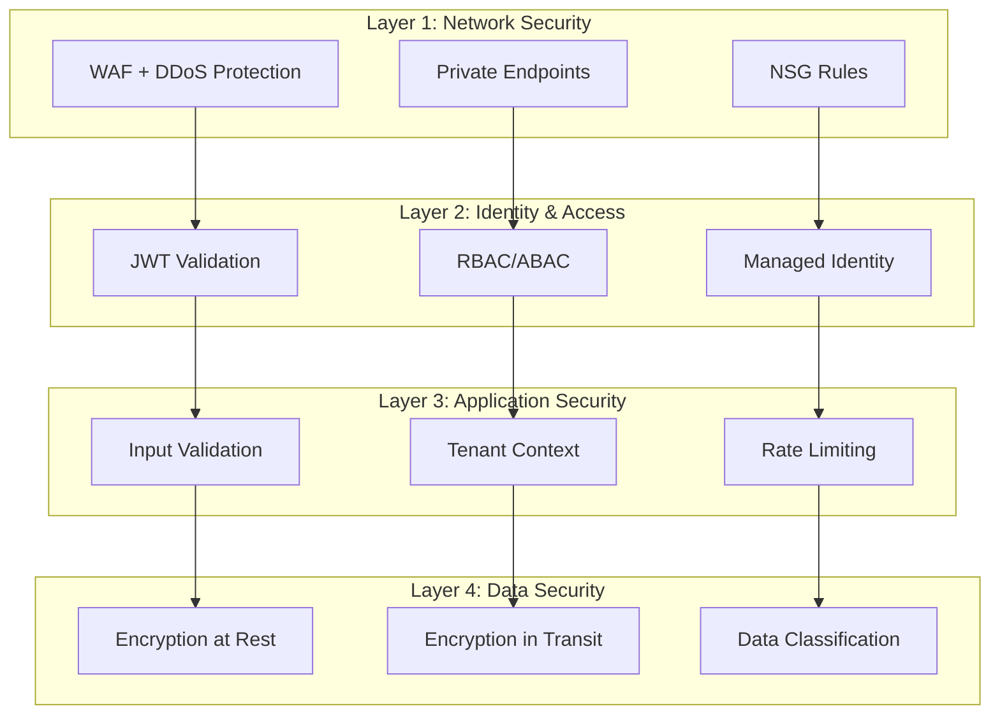

# Security & Compliance Guidelines for Pooled Multi-Tenant Architecture

*Version 1.0 – 2025-06-20*

## 1. 概要

本書は、Azure AI Foundry Agent Service (FAS) のPooled（共有）マルチテナント方式における包括的なセキュリティ・コンプライアンス要件を定義します。ゼロトラスト原則に基づく多層防御と、データ主権の確保を最優先とします。

## 2. セキュリティアーキテクチャ原則

### 2.1 ゼロトラスト原則
- **Never Trust, Always Verify**: 全てのアクセス要求を検証
- **Least Privilege Access**: 必要最小限の権限付与
- **Assume Breach**: 侵害を前提とした防御設計
- **Verify Explicitly**: 明示的な認証・認可

### 2.2 多層防御戦略



## 3. 認証・認可フレームワーク

### 3.1 JWT Token 仕様

#### 3.1.1 Token構造
```json
{
  "header": {
    "alg": "RS256",
    "typ": "JWT",
    "kid": "key-id"
  },
  "payload": {
    "iss": "https://sts.windows.net/{tenant-id}/",
    "aud": "api://ai-foundry-agents",
    "sub": "user-object-id",
    "extension_tenantId": "contoso",
    "roles": ["agent.user", "agent.admin"],
    "email": "user@contoso.com",
    "name": "John Doe",
    "iat": 1640995200,
    "exp": 1641001200,
    "nbf": 1640995200
  }
}
```

#### 3.1.2 検証要件
1. **署名検証**: RSA256アルゴリズムによる署名確認
2. **発行者確認**: `iss`クレームの有効性検証
3. **対象者確認**: `aud`クレームがサービス識別子と一致
4. **有効期限確認**: `exp`クレームによる期限切れ検証
5. **テナント検証**: `extension_tenantId`の存在と有効性確認

### 3.2 RBAC/ABAC実装

#### 3.2.1 ロール定義
```json
{
  "roles": {
    "agent.admin": {
      "permissions": [
        "agent.create",
        "agent.read",
        "agent.update", 
        "agent.delete",
        "thread.create",
        "thread.read",
        "thread.update",
        "thread.delete"
      ],
      "conditions": [
        "@Resource.tag.tenantId == @Principal.extension_tenantId"
      ]
    },
    "agent.user": {
      "permissions": [
        "agent.read",
        "thread.create",
        "thread.read",
        "message.create",
        "message.read"
      ],
      "conditions": [
        "@Resource.tag.tenantId == @Principal.extension_tenantId"
      ]
    }
  }
}
```

#### 3.2.2 条件付きアクセス
```python
# ABAC条件評価例
def evaluate_abac_condition(principal, resource, action):
    """ABAC条件評価"""
    
    # テナント境界チェック
    principal_tenant = principal.get("extension_tenantId")
    resource_tenant = resource.get("tenantId") or resource.get("metadata", {}).get("tenantId")
    
    if principal_tenant != resource_tenant:
        return False
    
    # ロールベース権限チェック
    required_permission = f"{resource.type}.{action}"
    user_roles = principal.get("roles", [])
    
    for role in user_roles:
        role_permissions = ROLE_PERMISSIONS.get(role, [])
        if required_permission in role_permissions:
            return True
    
    return False
```

## 4. データセキュリティ

### 4.1 暗号化要件

#### 4.1.1 保存時暗号化 (Encryption at Rest)
| サービス | 暗号化方式 | キー管理 |
|---------|------------|----------|
| **Cosmos DB** | AES-256 | Microsoft Managed Key (推奨: CMK) |
| **Azure Storage** | AES-256 | Customer Managed Key (CMK) |
| **AI Search** | AES-256 | Microsoft Managed Key |
| **Key Vault** | HSM-backed | Hardware Security Module |

#### 4.1.2 転送時暗号化 (Encryption in Transit)
- **TLS 1.2以上**: 全通信で強制
- **Certificate Pinning**: API Gateway レベルで実装
- **Perfect Forward Secrecy**: 鍵交換アルゴリズムの使用

#### 4.1.3 暗号化実装例
```python
from azure.keyvault.secrets import SecretClient
from azure.identity import DefaultAzureCredential
from cryptography.fernet import Fernet
import base64

class DataEncryption:
    """データ暗号化サービス"""
    
    def __init__(self, keyvault_url: str):
        credential = DefaultAzureCredential()
        self.kv_client = SecretClient(vault_url=keyvault_url, credential=credential)
        self._encryption_key = None
    
    def get_encryption_key(self, tenant_id: str) -> bytes:
        """テナント専用暗号化キー取得"""
        secret_name = f"{tenant_id}-encryption-key"
        
        try:
            secret = self.kv_client.get_secret(secret_name)
            return base64.b64decode(secret.value)
        except Exception:
            # キーが存在しない場合は新規作成
            new_key = Fernet.generate_key()
            self.kv_client.set_secret(secret_name, base64.b64encode(new_key).decode())
            return new_key
    
    def encrypt_sensitive_data(self, data: str, tenant_id: str) -> str:
        """機密データ暗号化"""
        key = self.get_encryption_key(tenant_id)
        fernet = Fernet(key)
        encrypted_data = fernet.encrypt(data.encode())
        return base64.b64encode(encrypted_data).decode()
    
    def decrypt_sensitive_data(self, encrypted_data: str, tenant_id: str) -> str:
        """機密データ復号化"""
        key = self.get_encryption_key(tenant_id)
        fernet = Fernet(key)
        decoded_data = base64.b64decode(encrypted_data)
        decrypted_data = fernet.decrypt(decoded_data)
        return decrypted_data.decode()
```

### 4.2 データ分類・ラベリング

#### 4.2.1 分類レベル
1. **Public**: 公開情報（制限なし）
2. **Internal**: 内部情報（社内限定）
3. **Confidential**: 機密情報（限定アクセス）
4. **Restricted**: 極秘情報（最小権限）

#### 4.2.2 ラベリング実装
```python
from enum import Enum
from typing import Dict, Any

class DataClassification(Enum):
    PUBLIC = "public"
    INTERNAL = "internal"
    CONFIDENTIAL = "confidential"
    RESTRICTED = "restricted"

class DataClassifier:
    """データ分類サービス"""
    
    CLASSIFICATION_RULES = {
        # PII データ
        "email": DataClassification.CONFIDENTIAL,
        "phone": DataClassification.CONFIDENTIAL,
        "ssn": DataClassification.RESTRICTED,
        "credit_card": DataClassification.RESTRICTED,
        
        # ビジネスデータ
        "financial": DataClassification.CONFIDENTIAL,
        "legal": DataClassification.RESTRICTED,
        "hr": DataClassification.CONFIDENTIAL,
        
        # 技術データ
        "logs": DataClassification.INTERNAL,
        "metrics": DataClassification.INTERNAL,
        "config": DataClassification.CONFIDENTIAL
    }
    
    @staticmethod
    def classify_data(data: Dict[str, Any], context: str = None) -> DataClassification:
        """データ分類実行"""
        
        # コンテキストベース分類
        if context and context in DataClassifier.CLASSIFICATION_RULES:
            return DataClassifier.CLASSIFICATION_RULES[context]
        
        # コンテンツベース分類
        classification = DataClassification.PUBLIC
        
        for key, value in data.items():
            key_lower = key.lower()
            
            # フィールド名ベース判定
            for pattern, level in DataClassifier.CLASSIFICATION_RULES.items():
                if pattern in key_lower:
                    if level.value == "restricted":
                        return DataClassification.RESTRICTED
                    elif level.value == "confidential" and classification != DataClassification.RESTRICTED:
                        classification = DataClassification.CONFIDENTIAL
                    elif level.value == "internal" and classification == DataClassification.PUBLIC:
                        classification = DataClassification.INTERNAL
        
        return classification
    
    @staticmethod
    def apply_data_protection(data: Dict[str, Any], classification: DataClassification, tenant_id: str) -> Dict[str, Any]:
        """分類レベルに応じたデータ保護適用"""
        
        if classification in [DataClassification.CONFIDENTIAL, DataClassification.RESTRICTED]:
            # 機密データは暗号化
            encryptor = DataEncryption(f"https://kv-{tenant_id}.vault.azure.net/")
            
            for key, value in data.items():
                if isinstance(value, str) and len(value) > 0:
                    data[key] = encryptor.encrypt_sensitive_data(value, tenant_id)
        
        # メタデータに分類情報追加
        data["_dataClassification"] = classification.value
        data["_protectionApplied"] = True
        
        return data
```

## 5. ネットワークセキュリティ

### 5.1 Web Application Firewall (WAF)

#### 5.1.1 OWASP Top 10 対策
```json
{
  "wafRules": {
    "sqlInjection": {
      "enabled": true,
      "action": "Block",
      "anomalyScoring": true
    },
    "crossSiteScripting": {
      "enabled": true,
      "action": "Block",
      "anomalyScoring": true
    },
    "remoteFileInclusion": {
      "enabled": true,
      "action": "Block"
    },
    "remoteCodeExecution": {
      "enabled": true,
      "action": "Block"
    },
    "phpInjection": {
      "enabled": true,
      "action": "Block"
    },
    "javaAttacks": {
      "enabled": true,
      "action": "Block"
    },
    "sessionFixation": {
      "enabled": true,
      "action": "Block"
    }
  },
  "customRules": [
    {
      "name": "RateLimitPerTenant",
      "priority": 100,
      "ruleType": "RateLimitRule",
      "rateLimitDurationInMinutes": 1,
      "rateLimitThreshold": 100,
      "matchConditions": [
        {
          "matchVariables": [
            {
              "variableName": "RequestHeaders",
              "selector": "x-tenant-id"
            }
          ],
          "operator": "Any"
        }
      ],
      "action": "Block"
    }
  ]
}
```

#### 5.1.2 DDoS Protection
```bicep
// DDoS Protection Plan
resource ddosProtection 'Microsoft.Network/ddosProtectionPlans@2023-09-01' = {
  name: 'ddos-${projectName}-${environment}'
  location: location
  properties: {}
  tags: {
    purpose: 'DDoS Protection'
    criticality: 'High'
  }
}

// Application Gateway with WAF
resource applicationGateway 'Microsoft.Network/applicationGateways@2023-09-01' = {
  name: 'agw-${projectName}-${environment}'
  location: location
  properties: {
    sku: {
      name: 'WAF_v2'
      tier: 'WAF_v2'
      capacity: 2
    }
    webApplicationFirewallConfiguration: {
      enabled: true
      firewallMode: 'Prevention'
      ruleSetType: 'OWASP'
      ruleSetVersion: '3.2'
      requestBodyCheck: true
      maxRequestBodySizeInKb: 128
      fileUploadLimitInMb: 100
    }
    gatewayIPConfigurations: [
      {
        name: 'appGatewayIpConfig'
        properties: {
          subnet: {
            id: applicationGatewaySubnet.id
          }
        }
      }
    ]
  }
}
```

### 5.2 Private Endpoints

#### 5.2.1 Private Endpoint 構成
```bicep
// Private Endpoint for Cosmos DB
resource cosmosPrivateEndpoint 'Microsoft.Network/privateEndpoints@2023-09-01' = {
  name: 'pe-cosmos-${projectName}-${environment}'
  location: location
  properties: {
    subnet: {
      id: privateEndpointSubnet.id
    }
    privateLinkServiceConnections: [
      {
        name: 'cosmos-connection'
        properties: {
          privateLinkServiceId: cosmosAccount.id
          groupIds: ['Sql']
        }
      }
    ]
  }
}

// Private DNS Zone
resource cosmosDnsZone 'Microsoft.Network/privateDnsZones@2020-06-01' = {
  name: 'privatelink.documents.azure.com'
  location: 'global'
}

// DNS Zone Link
resource cosmosDnsZoneLink 'Microsoft.Network/privateDnsZones/virtualNetworkLinks@2020-06-01' = {
  parent: cosmosDnsZone
  name: 'cosmos-dns-link'
  location: 'global'
  properties: {
    registrationEnabled: false
    virtualNetwork: {
      id: virtualNetwork.id
    }
  }
}
```

## 6. 監査・コンプライアンス

### 6.1 監査ログ要件

#### 6.1.1 必須ログイベント
1. **認証イベント**: ログイン成功/失敗
2. **認可イベント**: アクセス許可/拒否
3. **データアクセス**: CRUD操作
4. **設定変更**: システム構成変更
5. **セキュリティイベント**: 異常検知

#### 6.1.2 ログ実装例
```python
import logging
import json
from datetime import datetime
from typing import Dict, Any
from core.tenant import TenantContext

class SecurityAuditLogger:
    """セキュリティ監査ログ"""
    
    def __init__(self):
        self.logger = logging.getLogger("security.audit")
    
    def log_authentication_event(self, user_id: str, tenant_id: str, success: bool, details: Dict[str, Any] = None):
        """認証イベントログ"""
        event = {
            "eventType": "authentication",
            "timestamp": datetime.utcnow().isoformat(),
            "userId": user_id,
            "tenantId": tenant_id,
            "success": success,
            "details": details or {}
        }
        
        if success:
            self.logger.info(f"Authentication successful: {json.dumps(event)}")
        else:
            self.logger.warning(f"Authentication failed: {json.dumps(event)}")
    
    def log_authorization_event(self, user_id: str, resource: str, action: str, granted: bool, reason: str = None):
        """認可イベントログ"""
        tenant_id = TenantContext.get_tenant()
        
        event = {
            "eventType": "authorization",
            "timestamp": datetime.utcnow().isoformat(),
            "userId": user_id,
            "tenantId": tenant_id,
            "resource": resource,
            "action": action,
            "granted": granted,
            "reason": reason
        }
        
        if granted:
            self.logger.info(f"Access granted: {json.dumps(event)}")
        else:
            self.logger.warning(f"Access denied: {json.dumps(event)}")
    
    def log_data_access_event(self, user_id: str, resource_type: str, resource_id: str, operation: str, classification: str = None):
        """データアクセスイベントログ"""
        tenant_id = TenantContext.get_tenant()
        
        event = {
            "eventType": "dataAccess",
            "timestamp": datetime.utcnow().isoformat(),
            "userId": user_id,
            "tenantId": tenant_id,
            "resourceType": resource_type,
            "resourceId": resource_id,
            "operation": operation,
            "dataClassification": classification
        }
        
        self.logger.info(f"Data access: {json.dumps(event)}")
    
    def log_security_incident(self, incident_type: str, severity: str, description: str, details: Dict[str, Any] = None):
        """セキュリティインシデントログ"""
        try:
            tenant_id = TenantContext.get_tenant()
        except:
            tenant_id = "unknown"
        
        event = {
            "eventType": "securityIncident",
            "timestamp": datetime.utcnow().isoformat(),
            "tenantId": tenant_id,
            "incidentType": incident_type,
            "severity": severity,
            "description": description,
            "details": details or {}
        }
        
        if severity in ["HIGH", "CRITICAL"]:
            self.logger.error(f"Security incident: {json.dumps(event)}")
        else:
            self.logger.warning(f"Security incident: {json.dumps(event)}")

# グローバル監査ログインスタンス
audit_logger = SecurityAuditLogger()
```

### 6.2 コンプライアンス要件

#### 6.2.1 GDPR 対応
```python
class GDPRCompliance:
    """GDPR コンプライアンス実装"""
    
    @staticmethod
    def anonymize_personal_data(data: Dict[str, Any]) -> Dict[str, Any]:
        """個人データの匿名化"""
        pii_fields = ["email", "name", "phone", "address", "ssn"]
        
        for field in pii_fields:
            if field in data:
                data[field] = f"[ANONYMIZED-{field.upper()}]"
        
        return data
    
    @staticmethod
    def handle_data_deletion_request(user_id: str, tenant_id: str):
        """データ削除要求処理"""
        # 1. Cosmos DB からユーザーデータ削除
        # 2. AI Search からユーザー関連ドキュメント削除
        # 3. Blob Storage からユーザーファイル削除
        # 4. 削除ログ記録
        
        audit_logger.log_data_access_event(
            user_id=user_id,
            resource_type="user_data",
            resource_id=user_id,
            operation="delete_all",
            classification="restricted"
        )
    
    @staticmethod
    def generate_data_export(user_id: str, tenant_id: str) -> Dict[str, Any]:
        """データポータビリティ対応"""
        # ユーザーの全データを収集してエクスポート
        user_data = {
            "userId": user_id,
            "tenantId": tenant_id,
            "exportDate": datetime.utcnow().isoformat(),
            "data": {
                "profile": {},
                "conversations": [],
                "files": [],
                "preferences": {}
            }
        }
        
        audit_logger.log_data_access_event(
            user_id=user_id,
            resource_type="user_data",
            resource_id=user_id,
            operation="export",
            classification="confidential"
        )
        
        return user_data
```

#### 6.2.2 SOC 2 Type II 対応
```python
class SOC2Controls:
    """SOC 2 コントロール実装"""
    
    @staticmethod
    def verify_logical_access_control():
        """論理アクセス制御検証"""
        checks = {
            "jwt_validation": True,
            "rbac_enforcement": True,
            "tenant_isolation": True,
            "session_management": True
        }
        return checks
    
    @staticmethod
    def verify_data_protection():
        """データ保護検証"""
        checks = {
            "encryption_at_rest": True,
            "encryption_in_transit": True,
            "key_management": True,
            "data_classification": True
        }
        return checks
    
    @staticmethod
    def verify_system_monitoring():
        """システム監視検証"""
        checks = {
            "audit_logging": True,
            "security_monitoring": True,
            "availability_monitoring": True,
            "performance_monitoring": True
        }
        return checks
```

## 7. インシデント対応

### 7.1 セキュリティインシデント分類

| 重要度 | 説明 | 対応時間 | エスカレーション |
|--------|------|----------|------------------|
| **CRITICAL** | サービス全体に影響、データ漏洩 | 15分以内 | CISO、CTO |
| **HIGH** | 単一テナントに影響、不正アクセス | 1時間以内 | セキュリティチーム |
| **MEDIUM** | 機能制限、パフォーマンス低下 | 4時間以内 | 運用チーム |
| **LOW** | 軽微な問題、ログ異常 | 24時間以内 | 開発チーム |

### 7.2 インシデント対応手順

#### 7.2.1 自動検知・対応
```python
class SecurityIncidentHandler:
    """セキュリティインシデント自動対応"""
    
    def __init__(self):
        self.thresholds = {
            "failed_logins": {"count": 5, "window": 300},  # 5分間で5回失敗
            "rate_limit": {"count": 1000, "window": 60},   # 1分間で1000リクエスト
            "cross_tenant_access": {"count": 1, "window": 1}  # 即座
        }
    
    def detect_brute_force_attack(self, user_id: str, tenant_id: str, failed_count: int):
        """ブルートフォース攻撃検知"""
        if failed_count >= self.thresholds["failed_logins"]["count"]:
            # アカウントロック
            self.lock_user_account(user_id, tenant_id, duration=3600)  # 1時間
            
            # セキュリティアラート
            audit_logger.log_security_incident(
                incident_type="brute_force_attack",
                severity="HIGH",
                description=f"Brute force attack detected for user {user_id}",
                details={"failedAttempts": failed_count, "tenantId": tenant_id}
            )
    
    def detect_tenant_boundary_violation(self, user_id: str, attempted_tenant: str, user_tenant: str):
        """テナント境界違反検知"""
        if attempted_tenant != user_tenant:
            # 即座にアクセス拒否
            audit_logger.log_security_incident(
                incident_type="tenant_boundary_violation",
                severity="CRITICAL",
                description=f"User {user_id} attempted cross-tenant access",
                details={
                    "userTenant": user_tenant,
                    "attemptedTenant": attempted_tenant
                }
            )
            
            # 緊急アラート送信
            self.send_emergency_alert("CRITICAL: Tenant boundary violation detected")
    
    def lock_user_account(self, user_id: str, tenant_id: str, duration: int):
        """ユーザーアカウントロック"""
        # アカウントロック実装
        pass
    
    def send_emergency_alert(self, message: str):
        """緊急アラート送信"""
        # 運用チームへのアラート送信実装
        pass
```

## 8. セキュリティテスト要件

### 8.1 侵入テスト (Penetration Testing)

#### 8.1.1 テスト範囲
1. **外部境界テスト**: WAF、API Gateway
2. **認証・認可テスト**: JWT、RBAC/ABAC
3. **テナント分離テスト**: データアクセス境界
4. **アプリケーションセキュリティ**: OWASP Top 10

#### 8.1.2 自動化テスト例
```python
import requests
import pytest
from typing import Dict, Any

class SecurityTestSuite:
    """セキュリティ自動テスト"""
    
    def __init__(self, base_url: str):
        self.base_url = base_url
    
    def test_sql_injection_protection(self):
        """SQLインジェクション保護テスト"""
        malicious_payloads = [
            "'; DROP TABLE users; --",
            "1' OR '1'='1",
            "'; SELECT * FROM sensitive_data; --"
        ]
        
        for payload in malicious_payloads:
            response = requests.get(
                f"{self.base_url}/agents",
                params={"search": payload},
                headers={"Authorization": "Bearer valid-token"}
            )
            
            # SQLエラーメッセージが返されないことを確認
            assert "sql" not in response.text.lower()
            assert "database" not in response.text.lower()
    
    def test_xss_protection(self):
        """XSS保護テスト"""
        xss_payloads = [
            "<script>alert('XSS')</script>",
            "javascript:alert('XSS')",
            ""
        ]
        
        for payload in xss_payloads:
            response = requests.post(
                f"{self.base_url}/agents",
                json={"name": payload, "instructions": "Test"},
                headers={"Authorization": "Bearer valid-token"}
            )
            
            # スクリプトタグがサニタイズされることを確認
            assert "<script>" not in response.text
            assert "javascript:" not in response.text
    
    def test_authentication_bypass(self):
        """認証バイパステスト"""
        # トークンなしアクセス
        response = requests.get(f"{self.base_url}/agents")
        assert response.status_code == 401
        
        # 無効トークンアクセス
        response = requests.get(
            f"{self.base_url}/agents",
            headers={"Authorization": "Bearer invalid-token"}
        )
        assert response.status_code == 401
        
        # 期限切れトークンアクセス
        expired_token = self.create_expired_token()
        response = requests.get(
            f"{self.base_url}/agents",
            headers={"Authorization": f"Bearer {expired_token}"}
        )
        assert response.status_code == 401
    
    def test_tenant_isolation(self):
        """テナント分離テスト"""
        # Contoso テナントでリソース作成
        contoso_token = self.create_tenant_token("contoso")
        response = requests.post(
            f"{self.base_url}/agents",
            json={"name": "Contoso Agent", "instructions": "Test"},
            headers={"Authorization": f"Bearer {contoso_token}"}
        )
        agent_id = response.json()["id"]
        
        # Fabrikam テナントで同じリソースにアクセス試行
        fabrikam_token = self.create_tenant_token("fabrikam")
        response = requests.get(
            f"{self.base_url}/agents/{agent_id}",
            headers={"Authorization": f"Bearer {fabrikam_token}"}
        )
        assert response.status_code in [403, 404]  # アクセス拒否
```

### 8.2 脆弱性スキャン

#### 8.2.1 静的解析 (SAST)
```yaml
# GitHub Actions - Security Scan
name: Security Scan

on:
  push:
    branches: [ main, develop ]
  pull_request:
    branches: [ main ]

jobs:
  security-scan:
    runs-on: ubuntu-latest
    steps:
    - uses: actions/checkout@v4
    
    - name: Run Bandit Security Scan
      run: |
        pip install bandit
        bandit -r src/ -f json -o bandit-report.json
    
    - name: Run Safety Check
      run: |
        pip install safety
        safety check --json --output safety-report.json
    
    - name: Upload Security Reports
      uses: actions/upload-artifact@v3
      with:
        name: security-reports
        path: |
          bandit-report.json
          safety-report.json
```

#### 8.2.2 動的解析 (DAST)
```yaml
# DAST Scan Configuration
dast_scan:
  name: Dynamic Security Testing
  runs-on: ubuntu-latest
  needs: deploy
  steps:
  - name: OWASP ZAP Scan
    uses: zaproxy/action-full-scan@v0.4.0
    with:
      target: 'https://api-dev.example.com'
      rules_file_name: '.zap/rules.tsv'
      cmd_options: '-a -j -m 10 -T 60'
```

## 9. セキュリティ運用

### 9.1 セキュリティ監視ダッシュボード

#### 9.1.1 KQLクエリ例
```kql
// セキュリティダッシュボード用クエリ

// 認証失敗率監視
SecurityEvent
| where TimeGenerated > ago(1h)
| where EventID == 4625  // Failed logon
| summarize FailedLogins = count() by bin(TimeGenerated, 5m), TenantId = tostring(customDimensions.tenantId)
| render timechart

// テナント境界違反検知
traces
| where TimeGenerated > ago(24h)
| where message contains "boundary violation"
| summarize ViolationCount = count() by 
    TenantId = tostring(customDimensions.tenantId),
    UserId = tostring(customDimensions.userId)
| order by ViolationCount desc

// 異常なAPI呼び出しパターン
requests
| where TimeGenerated > ago(1h)
| summarize RequestCount = count() by 
    bin(TimeGenerated, 1m),
    TenantId = tostring(customDimensions.tenantId),
    UserId = tostring(customDimensions.userId)
| where RequestCount > 100  // 閾値設定
| render scatterchart

// データアクセスパターン監視
AppTraces
| where TimeGenerated > ago(1h)
| where Message contains "dataAccess"
| extend DataClassification = tostring(customDimensions.dataClassification)
| summarize AccessCount = count() by 
    DataClassification,
    TenantId = tostring(customDimensions.tenantId)
| render piechart
```

### 9.2 アラート設定

#### 9.2.1 Critical アラート
```json
{
  "alertRules": [
    {
      "name": "TenantBoundaryViolation",
      "description": "Tenant boundary violation detected",
      "severity": "Critical",
      "query": "traces | where message contains 'boundary violation'",
      "threshold": 1,
      "timeWindow": "PT1M",
      "actions": ["email", "sms", "teams"]
    },
    {
      "name": "HighFailedAuthentication",
      "description": "High number of failed authentication attempts",
      "severity": "High", 
      "query": "SecurityEvent | where EventID == 4625 | summarize count() by bin(TimeGenerated, 5m) | where count_ > 10",
      "threshold": 10,
      "timeWindow": "PT5M",
      "actions": ["email", "teams"]
    },
    {
      "name": "DataExfiltrationPattern",
      "description": "Potential data exfiltration detected",
      "severity": "Critical",
      "query": "requests | where TimeGenerated > ago(5m) | summarize TotalRequests = count(), DataVolume = sum(ResponseSize) by UserId = tostring(customDimensions.userId) | where TotalRequests > 1000 or DataVolume > 100000000",
      "threshold": 1,
      "timeWindow": "PT5M",
      "actions": ["email", "sms", "teams", "auto-disable-user"]
    }
  ]
}
```

## 10. 関連ドキュメント

- [Pooled Infrastructure Specification](./pooled-infrastructure-spec.md)
- [Pooled Application Specification](./pooled-application-spec.md)
- [Operation & Monitoring Procedures](./operations-procedures.md)
- [Incident Response Playbook](./incident-response-playbook.md)
- [Compliance Audit Guide](./compliance-audit-guide.md)
