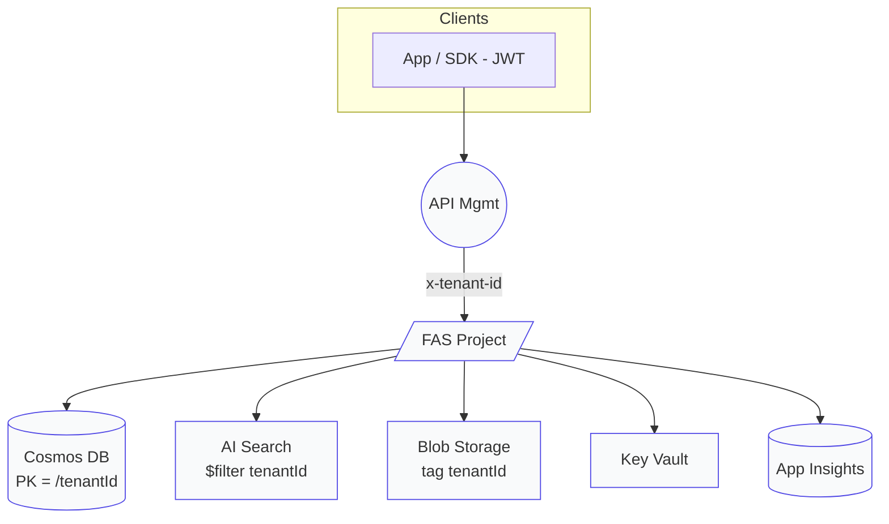

## Pooled‑Agents アーキテクチャ仕様書

*Version 1.0 – 2025‑06‑20*

### 1. 概要

本書は Azure **AI Foundry Agent Service (FAS)** の *Standard Agent Setup* と顧客管理 (BYO) データストアを利用し、**Pooled（共有）マルチテナント**方式を実装するための設計および検証指針をまとめたものです。ひとつの FAS **プロジェクト** に複数テナントを収容しつつ、\*\*4 層（プラットフォーム RBAC/ABAC → API ゲートウェイ (JWT) → FAS プロジェクト → データ層）\*\*で論理的な境界を維持します。

### 2. 用語定義

| 用語                 | 定義                                                                                 |
| ------------------ | ---------------------------------------------------------------------------------- |
| **テナント**           | 論理的な顧客アカウント (例: **Contoso**, **Fabrikam**)                                         |
| **Pooled モデル**     | 1 つの FAS プロジェクトおよび Azure リソースを複数テナントで共有し、タグ・ロール・パーティションキーで分離する方式                   |
| **Standard Setup** | エージェント状態を顧客管理の Cosmos DB / Azure AI Search / Blob / Key Vault に保存する FAS のデプロイオプション |

### 3. ハイレベル構成図



### 4. 設計原則

1. **ゼロトラスト** – 各層で再認証・再認可を行う。
2. **属性ベース多層防御** – RBAC に ABAC 条件 (tenantId タグ) を組み合わせ最小権限を徹底。
3. **データ主権** – すべてのコレクション／インデックス／コンテナに `tenantId` をパーティションキーまたはフィルターとして必須化。

### 5. リソース設計

| サービス                | プール方式           | 分離メカニズム                                                      |
| ------------------- | --------------- | ------------------------------------------------------------ |
| **FAS プロジェクト**      | 共有 (1 プロジェクト)   | **組み込みロール**: Account Owner / Project Manager / User          |
| **Cosmos DB**       | 単一アカウント・単一 DB   | コンテナ `partitionKey=/tenantId`  (階層 PK `/tenantId/userId` も可) |
| **Azure AI Search** | 共有              | テナント毎インデックス **または** `$filter=tenantId`                       |
| **Blob Storage**    | 共有アカウント         | コンテナ／フォルダー per tenant + ABAC 条件ロール                           |
| **Key Vault**       | 推奨: テナント毎 Vault | 代替: 1 Vault + 秘密ごとの RBAC スコープ                                |

### 6. アイデンティティとアクセス制御

#### 6.1 プラットフォーム RBAC / ABAC

* 例: Managed Identity `mi-contoso` に **Storage Blob Data Reader** ロールを付与し、ロール条件 `@Resource.tag.tenantId == "contoso"` を設定。
* Cosmos DB には **Cosmos DB Built‑in Data Contributor** をコンテナスコープで付与。

#### 6.2 API Gateway (Azure API Management)

* `validate-jwt` ポリシーで `extension_tenantId` と `roles` クレームを検証し、`x-tenant-id` ヘッダーに転記。

#### 6.3 FAS プロジェクト

* エージェント呼び出し時に `thread.metadata.tenantId` を格納し、Tool 呼び出しへ継承。
* プロジェクトレベル RBAC で UI / API 操作をテナント管理者に限定。

#### 6.4 Tool 用 Managed Identity

* Functions / Logic Apps / Container Apps / ML Endpoint など任意の Tool は、各テナント専用の **User‑Assigned MI** で実行し、同一 RBAC/ABAC ポリシーを継承。

### 7. データ層ルール

1. **Cosmos DB** – SDK 呼び出しで必ず `PartitionKey(tenantId)` を指定。リソーストークンもパーティション単位で発行。
2. **AI Search** – クライアントラッパーで `$filter=tenantId` を自動付与。
3. **Blob** – User‑Delegation SAS をテナントコンテナスコープで払い出す。
4. **Key Vault** – Vault‑per‑tenant が望ましい。共有 Vault の場合は `contoso‑<name>` 命名 + RBAC 制御。

### 8. デプロイ手順チェックリスト

1. **Managed Identity** をテナント数分作成。
2. **Standard Setup** 用 Bicep をデプロイし、BYO Cosmos / Search / Blob をバインド。
3. **RBAC/ABAC ロール割り当て** を CLI で適用。
4. **API Management** に JWT 検証ポリシーを設定。
5. **初期データ投入** – テナントごとにパーティション/インデックス/コンテナを作成。

### 9. 検証シナリオ

| # | テスト内容                                          | 期待結果                 |
| - | ---------------------------------------------- | -------------------- |
| 1 | Contoso JWT → Cosmos `/tenantId=contoso` CRUD  | **200 OK**           |
| 2 | Fabrikam JWT → Contoso API パス呼び出し              | **401 Unauthorized** |
| 3 | Contoso JWT → Cosmos `/tenantId=fabrikam` CRUD | **403 Forbidden**    |
| 4 | Fabrikam MI で Contoso Blob 取得                  | **403 Forbidden**    |
| 5 | App Insights で `tenantId` 混在検索                 | **0 レコード**           |

### 10. ロギング & 監視

* **Application Insights Telemetry Initializer** で `tenantId` を `customDimensions` に付与。
* KQL 例: `traces | summarize count() by customDimensions.tenantId` で境界維持を確認。

### 11. CI/CD 自動化

* **GitHub Actions** で Bicep デプロイ ➜ CLI テストを実行し、401/403 テストが通らなければジョブ失敗。
* Workload Identity Federation を使用し、Secrets を不要化。

### 12. 付録

#### 12.1 タグ & 命名規則

| リソース        | タグ                   | 例             |
| ----------- | -------------------- | ------------- |
| RG          | `tenantScope=shared` | rg-fas-pooled |
| Blob コンテナ   | `tenantId`           | contoso       |
| Cosmos コンテナ | (PK)                 | events        |

#### 12.2 ロール割り当てスクリプト例

```bash
az role assignment create \
  --assignee-object-id $CONTOSO_MI_ID \
  --role "Storage Blob Data Reader" \
  --scope /subscriptions/$SUB/resourceGroups/rg-fas-pooled/providers/Microsoft.Storage/storageAccounts/sa-pooled \
  --condition "@Resource.tag.tenantId == 'contoso'"
```
