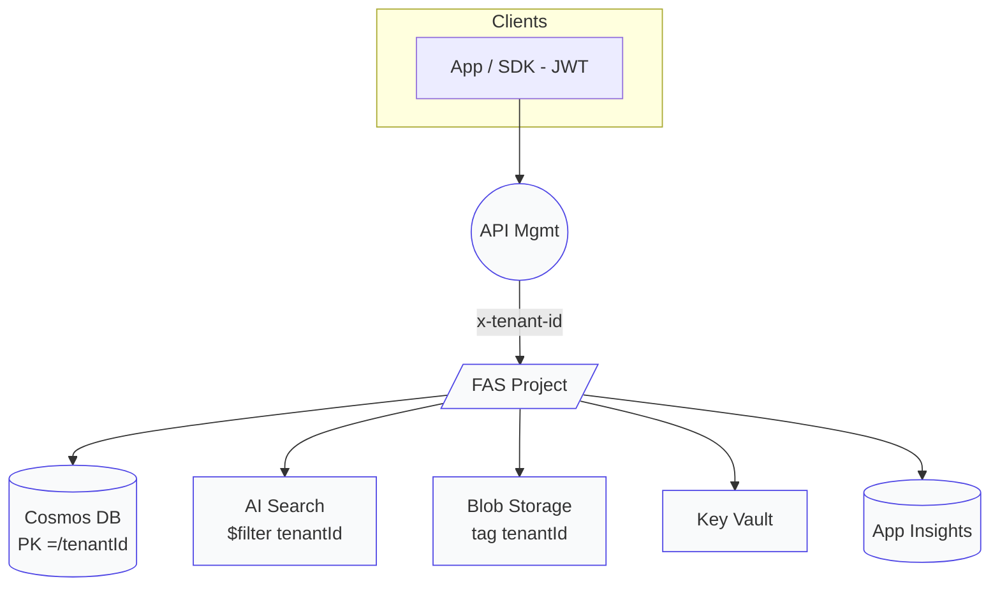

## Pooled‑Agents Architecture Specification

*Version 1.0 – 2025‑06‑20*

### 1. Overview

This document defines a **Pooled (shared) multi‑tenant architecture** for Azure **AI Foundry Agent Service** (FAS) using *Standard Agent Setup* with customer‑managed (“BYO”) data stores. A single FAS **project** hosts agents that serve many tenants, while logical isolation is enforced across **four security layers**: Platform RBAC/ABAC, API Gateway (JWT), FAS Project RBAC + metadata, and Data‑layer partitioning.([learn.microsoft.com](https://learn.microsoft.com/en-us/azure/ai-foundry/agents/concepts/standard-agent-setup?utm_source=chatgpt.com))

### 2. Terminology & Scope

| Term             | Definition                                                                                                                                                                                                                                          |
| ---------------- | --------------------------------------------------------------------------------------------------------------------------------------------------------------------------------------------------------------------------------------------------- |
| *Tenant*         | A logical customer account (e.g., **Contoso** or **Fabrikam**).                                                                                                                                                                                     |
| *Pooled model*   | Multiple tenants share the same FAS project and Azure resources but are isolated by tags, roles, and partition keys.                                                                                                                                |
| *Standard Setup* | FAS deployment option that stores agent state in customer‑owned Cosmos DB, Azure AI Search, Blob Storage and Key Vault.([learn.microsoft.com](https://learn.microsoft.com/en-us/azure/ai-services/agents/environment-setup?utm_source=chatgpt.com)) |

### 3. High‑Level Architecture



### 4. Core Design Principles

1. **Zero trust** – every request is re‑authenticated and re‑authorized at each layer.([learn.microsoft.com](https://learn.microsoft.com/en-us/azure/role-based-access-control/role-assignments?utm_source=chatgpt.com))
2. **Attribute‑based defense in depth** – RBAC scopes are refined with ABAC conditions that match `tenantId` resource tags.([learn.microsoft.com](https://learn.microsoft.com/en-us/azure/role-based-access-control/conditions-role-assignments-powershell?utm_source=chatgpt.com))
3. **Data owns the boundary** – all collections, indexes, and containers include `tenantId` as a partition key or mandatory security filter.([learn.microsoft.com](https://learn.microsoft.com/en-us/azure/architecture/guide/multitenant/service/cosmos-db?utm_source=chatgpt.com), [learn.microsoft.com](https://learn.microsoft.com/en-us/azure/search/search-security-rbac?utm_source=chatgpt.com))

### 5. Resource Topology

| Azure Service       | Pooling Strategy            | Isolation Mechanism                                                                                                                                                                                                             |
| ------------------- | --------------------------- | ------------------------------------------------------------------------------------------------------------------------------------------------------------------------------------------------------------------------------- |
| **FAS Project**     | One **shared** project      | Built‑in roles: *Account Owner*, *Project Manager*, *User*.([learn.microsoft.com](https://learn.microsoft.com/en-us/azure/ai-services/agents/environment-setup?utm_source=chatgpt.com))                                         |
| **Cosmos DB**       | One account, one DB         | Container with `partitionKey=/tenantId`; optional hierarchical PK (`/tenantId/userId`).([learn.microsoft.com](https://learn.microsoft.com/en-us/azure/architecture/guide/multitenant/service/cosmos-db?utm_source=chatgpt.com)) |
| **Azure AI Search** | Shared service              | Index‑per‑tenant **or** single index + `$filter=tenantId`.([learn.microsoft.com](https://learn.microsoft.com/en-us/azure/search/search-security-rbac?utm_source=chatgpt.com))                                                   |
| **Blob Storage**    | Shared account              | Container/folder per tenant; ABAC role condition on `tag.tenantId`.([learn.microsoft.com](https://learn.microsoft.com/en-us/azure/role-based-access-control/conditions-role-assignments-powershell?utm_source=chatgpt.com))     |
| **Key Vault**       | Preferred: vault‑per‑tenant | Alternative: single vault + RBAC scopes per secret.([learn.microsoft.com](https://learn.microsoft.com/en-us/azure/architecture/guide/multitenant/service/key-vault?utm_source=chatgpt.com))                                     |

### 6. Identity & Access Control

#### 6.1 Platform RBAC & ABAC

* Assign **Storage Blob Data Reader** or similar roles to each tenant’s Managed Identity with a tag‑based condition: `@Resource.tag.tenantId == 'contoso'`.([learn.microsoft.com](https://learn.microsoft.com/en-us/azure/role-based-access-control/conditions-role-assignments-powershell?utm_source=chatgpt.com))
* Use **Cosmos DB Built‑in Data Contributor** scoped to container level.([learn.microsoft.com](https://learn.microsoft.com/en-us/azure/architecture/guide/multitenant/service/cosmos-db?utm_source=chatgpt.com))

#### 6.2 API Gateway (Azure API Management)

* `validate‑jwt` policy enforces `extension_tenantId` and role claims, then injects `x‑tenant-id` header.([learn.microsoft.com](https://learn.microsoft.com/en-us/azure/ai-services/agents/environment-setup?utm_source=chatgpt.com))

#### 6.3 FAS Project

* Store the header value in `thread.metadata.tenantId`; FAS passes it to every Tool call.([learn.microsoft.com](https://learn.microsoft.com/en-us/azure/ai-foundry/agents/concepts/standard-agent-setup?utm_source=chatgpt.com))
* Use project‑level RBAC to restrict UI/API operations per admin group.

#### 6.4 Managed Identity for Tools

* All Tool types (Functions, Logic Apps, Container Apps, ML Endpoints) run under a User‑Assigned MI bound to the tenant’s RBAC scopes.([learn.microsoft.com](https://learn.microsoft.com/en-us/azure/container-apps/managed-identity?utm_source=chatgpt.com))

### 7. Data‑Layer Rules

1. **Cosmos** – Any SDK call must specify `PartitionKey(tenantId)`. Resource tokens are issued per partition to add a second gate.([learn.microsoft.com](https://learn.microsoft.com/en-us/azure/architecture/guide/multitenant/service/cosmos-db?utm_source=chatgpt.com))
2. **Search** – Client library wrapper automatically applies the `$filter`.([learn.microsoft.com](https://learn.microsoft.com/en-us/azure/search/search-security-rbac?utm_source=chatgpt.com))
3. **Blob** – Use User‑Delegation SAS scoped to the tenant container.
4. **Key Vault** – Separate vault preferred; if shared, secrets named `<tenantId>-<name>`.

### 8. Deployment Checklist (CLI)

1. **Create Managed Identities** for each tenant.
2. **Deploy Standard Setup** Bicep, binding existing Cosmos/Search/Blob resources.([learn.microsoft.com](https://learn.microsoft.com/en-us/azure/ai-foundry/agents/concepts/standard-agent-setup?utm_source=chatgpt.com))
3. **Assign RBAC roles** with ABAC conditions.([learn.microsoft.com](https://learn.microsoft.com/en-us/azure/role-based-access-control/conditions-role-assignments-powershell?utm_source=chatgpt.com))
4. **Configure APIM** validate‑jwt policy.
5. **Seed initial data** into each partition/container/index.

### 9. Validation Plan

| # | Test                                      | Expected Result                                                                                                                                                                                           |
| - | ----------------------------------------- | --------------------------------------------------------------------------------------------------------------------------------------------------------------------------------------------------------- |
| 1 | Contoso JWT → Cosmos `/tenantId=contoso`  | **200 OK**                                                                                                                                                                                                |
| 2 | Fabrikam JWT → Contoso API route          | **401 Unauthorized**                                                                                                                                                                                      |
| 3 | Contoso JWT → Cosmos `/tenantId=fabrikam` | **403 Forbidden**                                                                                                                                                                                         |
| 4 | Fabricam MI downloads Contoso blob        | **403 Forbidden**                                                                                                                                                                                         |
| 5 | App Insights query mixes tenantId         | **0 records**.([learn.microsoft.com](https://learn.microsoft.com/en-us/dynamics365/business-central/dev-itpro/developer/devenv-instrument-application-for-telemetry-app-insights?utm_source=chatgpt.com)) |

### 10. Logging & Monitoring

* Add an **Application Insights Telemetry Initializer** that copies `tenantId` into `customDimensions`.([learn.microsoft.com](https://learn.microsoft.com/en-us/dynamics365/business-central/dev-itpro/developer/devenv-instrument-application-for-telemetry-app-insights?utm_source=chatgpt.com))
* Query: `traces | summarize count() by customDimensions.tenantId` to confirm separation.

### 11. CI Automation

* GitHub Actions workflow deploys template, then runs az CLI tests; pipeline fails if any 401/403 expectation is not met.
* Use Workload Identity Federation—no secrets stored.([learn.microsoft.com](https://learn.microsoft.com/en-us/azure/container-registry/container-registry-authentication-managed-identity?utm_source=chatgpt.com))

### 12. Appendix

#### 12.1 Tag & Naming Convention

| Resource         | Tag                  | Example Name  |
| ---------------- | -------------------- | ------------- |
| RG               | `tenantScope=shared` | rg‑fas‑pooled |
| Blob Container   | `tenantId`           | contoso       |
| Cosmos Container | N/A (PK)             | events        |

#### 12.2 Sample Role‑Assignment Script

```bash
az role assignment create \
  --assignee-object-id $CONTOSO_MI_ID \
  --role "Storage Blob Data Reader" \
  --scope /subscriptions/$SUB/resourceGroups/rg-fas-pooled/providers/Microsoft.Storage/storageAccounts/sa-pooled \
  --condition "@Resource.tag.tenantId == 'contoso'"
```
