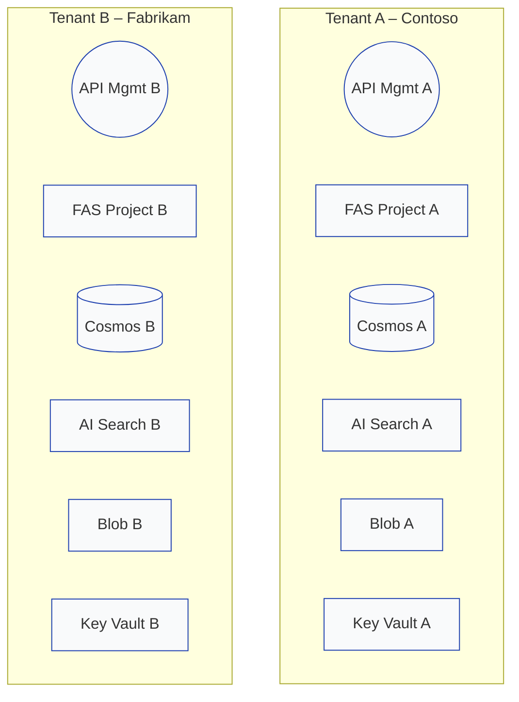

## Silo‑Agents アーキテクチャ仕様書

*Version 1.0 – 2025‑06‑20*

### 1. 概要

本書は Azure **AI Foundry Agent Service (FAS)** において **Silo（専有）マルチテナント**方式を実装する際の設計・運用指針をまとめたものです。各テナントが **サブスクリプション／リソースグループ／ネットワーク／FAS プロジェクト／データストア** を完全に専有することで、医療・金融など厳格な規制やデータ主権要件に対応します。

### 2. 用語定義

| 用語                 | 定義                                                                                 |
| ------------------ | ---------------------------------------------------------------------------------- |
| **テナント**           | 論理的顧客アカウント (例: **Contoso**, **Fabrikam**)                                          |
| **Silo モデル**       | テナントごとにフルスタックの Azure リソース境界を物理的に分離する方式                                             |
| **Standard Setup** | Agent 状態を Cosmos DB / AI Search / Blob / Key Vault といった顧客管理リソースに保存する FAS デプロイオプション |

### 3. ハイレベル構成図



### 4. 設計原則

1. **ハードバウンダリ** – テナント毎にサブスクリプション／VNet／Key Vault を分離。
2. **最小権限** – 各テナント管理者の Owner 権限は自テナント内に限定。
3. **データ完全隔離** – パーティションやフィルターによる論理分離は不要。リソース自体を専有。

### 5. テナントあたりのリソース構成

| Azure サービス                       | 配置単位                  | 分離ポイント                                |
| -------------------------------- | --------------------- | ------------------------------------- |
| **サブスクリプション**                    | 1 テナント 1 本 (または専用 RG) | 課金と RBAC を完全分離                        |
| **VNet**                         | テナント専用                | Private Endpoint 経由のみ通信               |
| **FAS プロジェクト**                   | 1                     | Standard Setup (BYO) 使用、RBAC はテナント内のみ |
| **Cosmos DB**                    | アカウント + DB 専有         | パーティション分割不要                           |
| **Azure AI Search**              | サービス専有                | クォータ・IAM がテナント単位                      |
| **Blob Storage**                 | アカウント専有               | ファイアウォールを専用 VNet に制限                  |
| **Key Vault**                    | Vault 専有              | PIM で JIT 権限付与                        |
| **App Insights / Log Analytics** | ワークスペース専有             | SLA ダッシュボードをテナント別に生成                  |

### 6. アイデンティティ & アクセス制御

* **プラットフォーム層** – Azure RBAC をサブスクリプション単位で適用。ABAC は基本不要。
* **API ゲートウェイ** – テナント毎の API Management が Entra ID JWT を検証。
* **FAS プロジェクト** – 組み込みロール (*Project Manager*, *User*) はテナント RBAC 境界内のみ。
* **Tool Identity** – System‑Assigned MI を使用し、ロールはテナントリソース内でのみ付与。

### 7. ネットワーク & コンプライアンス

| 要件              | 実装方法                                               |
| --------------- | -------------------------------------------------- |
| PCI DSS / HIPAA | 専用 Policy イニシアティブ + 全リソース Private Link 化           |
| 地域ロック           | テナント管轄地域の Azure リージョンにデプロイ                         |
| 顧客管理キー (CMK)    | テナント Vault に CMK を格納し、Cosmos / Blob / FAS 暗号化キーに指定 |

### 8. デプロイチェックリスト

1. テナント用サブスクリプション (または RG) を作成。
2. ランディングゾーン Bicep (VNet, Private DNS, Key Vault, Log Analytics) を適用。
3. Standard Setup テンプレートで FAS プロジェクト + Cosmos / Search / Blob を展開。
4. API Management を構成し、テナント独自ドメイン + JWT 検証を実装。
5. RBAC を割り当て (テナント管理者=Owner、FAS MI=Data Contributor)。

### 9. 検証シナリオ

| # | テスト                                 | 期待結果              |
| - | ----------------------------------- | ----------------- |
| 1 | テナント A トークン → テナント A API            | **200 OK**        |
| 2 | テナント A トークン → テナント B API (URL Typo) | **DNS エラー / 404** |
| 3 | テナント A MI → Cosmos B エンドポイント        | **ネットワークタイムアウト**  |
| 4 | テナント B MI → テナント A Blob 一覧          | **403 Forbidden** |
| 5 | サブスクリプション単位の課金レポート                  | テナント間で混在なし        |

### 10. ロギング & 監視

* Application Insights と Log Analytics をテナント毎に専有。
* MSP や運用側は Diagnostic Settings でクロステナント収集可能。

### 11. CI/CD 戦略

* `tenantId` パラメータ化した **Bicep モジュール** を GitHub Actions OIDC で各サブスクリプションにデプロイ。
* PR 環境でエフェメラルな Silo テナントを自動生成・検証後に破棄。

### 12. 付録

#### 12.1 命名規則 (テナントごと)

| リソース           | パターン              | 例                |
| -------------- | ----------------- | ---------------- |
| Subscription   | `sub-{tenant}`    | `sub-contoso`    |
| Resource Group | `rg-{tenant}-fas` | `rg-contoso-fas` |
| Cosmos DB      | `cosmos-{tenant}` | `cosmos-contoso` |
| Search         | `search-{tenant}` | `search-contoso` |
| Storage        | `st{tenant}`      | `stcontoso`      |
| Key Vault      | `kv-{tenant}`     | `kv-contoso`     |

#### 12.2 デプロイコマンド例

```bash
az deployment sub create \
  --name deploy-fas-contoso \
  --location japaneast \
  --template-file main.bicep \
  --parameters tenantId=contoso env=jpeast
```
