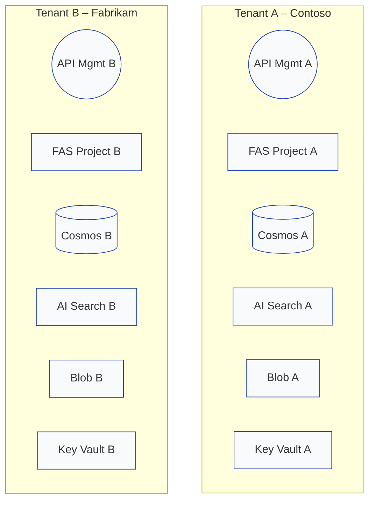

## Silo‑Agents Architecture Specification

*Version 1.0 – 2025‑06‑20*

### 1. Overview

This document defines a **Silo (dedicated) multi‑tenant architecture** for Azure **AI Foundry Agent Service** (FAS). Each tenant receives its own isolated stack of FAS resources—**subscription, resource group, Standard‑Setup FAS project, Cosmos DB, Azure AI Search, Blob Storage, Key Vault and monitoring**—thereby meeting strict regulatory or data‑sovereignty requirements.

### 2. Terminology & Scope

| Term             | Definition                                                                                             |
| ---------------- | ------------------------------------------------------------------------------------------------------ |
| *Tenant*         | A logical customer account (e.g., **Contoso** or **Fabrikam**).                                        |
| *Silo model*     | Every tenant owns a fully separated Azure resource boundary; no resources are shared.                  |
| *Standard Setup* | FAS deployment option that stores agent state in customer‑owned Cosmos DB, Search, Blob and Key Vault. |

### 3. High‑Level Architecture



*Each tenant stack lives in its own subscription or resource group; cross‑stack traffic is blocked at the Azure front door.*

### 4. Design Principles

1. **Hard boundary isolation** – Azure subscription / VNet / Key Vault per tenant.
2. **Least privilege** – Tenant admins hold Owner at their subscription only; no roles span tenants.
3. **Zero data bleed** – No partition keys or filters are shared; every datastore is private to one tenant.

### 5. Resource Topology per Tenant

| Azure Service                    | Deployment per Tenant                                 | Isolation Notes                        |
| -------------------------------- | ----------------------------------------------------- | -------------------------------------- |
| **Subscription**                 | 1 dedicated subscription (optional: management group) | Simplifies billing segregation.        |
| **VNet**                         | VNet‑per‑tenant with Private Endpoints to PaaS        | Prevents lateral movement.             |
| **FAS Project**                  | One project using Standard Setup                      | Project RBAC scoped to tenant only.    |
| **Cosmos DB**                    | Dedicated account & DB                                | No need for partition key segregation. |
| **Azure AI Search**              | Dedicated search service                              | Quota isolated; IAM separate.          |
| **Blob Storage**                 | Dedicated storage account                             | Firewall locked to tenant VNet.        |
| **Key Vault**                    | Per‑tenant vault                                      | PIM enforced for elevated ops.         |
| **App Insights / Log Analytics** | Per‑tenant workspace                                  | Enables per‑tenant SLA dashboards.     |

### 6. Identity & Access Control

* **Platform layer** – Each tenant subscription uses standard Azure RBAC; no ABAC required because physical separation is achieved.
* **API Gateway** – API Management (per tenant) validates Entra ID tokens; optional custom domain.
* **FAS Project** – Built‑in roles (*Project Manager*, *User*) apply inside tenant boundary.
* **Tool Identity** – Tools run under tenant‑scoped **System‑Assigned MI**; roles assigned only within tenant subscription.

### 7. Networking & Compliance Options

| Requirement          | Implementation                                                                                  |
| -------------------- | ----------------------------------------------------------------------------------------------- |
| PCI DSS / HIPAA      | Deploy subscription in dedicated Azure Policy initiative; enable Private Link for all services. |
| Geo‑lock             | Choose region aligned to tenant jurisdiction.                                                   |
| Customer‑managed CMK | Store CMK in tenant Key Vault; configure Cosmos DB, Blob Storage and FAS encryption to use it.  |

### 8. Deployment Checklist

1. **Create subscription** (or resource group) for the tenant.
2. **Deploy landing zone** (Bicep): VNet, Private DNS, Key Vault, Log Analytics.
3. **Run Standard‑Setup template** to create FAS project bound to new Cosmos DB, Search, Blob.
4. **Configure API Management** with tenant domain and JWT validation.
5. **Assign RBAC**: Tenant admin = Owner; FAS MIs = Data Contributor roles inside tenant only.

### 9. Validation Plan

| # | Test                                         | Expected Result                    |
| - | -------------------------------------------- | ---------------------------------- |
| 1 | Tenant A token calls Tenant A API            | **200 OK**                         |
| 2 | Tenant A token calls Tenant B API (URL typo) | **DNS failure / 404**              |
| 3 | Tenant A MI tries to reach Cosmos B endpoint | **Network timeout** (no NSG route) |
| 4 | Tenant B MI lists blobs in Tenant A account  | **403 Forbidden**                  |
| 5 | Billing exports per subscription             | No blended charges across tenants. |

### 10. Logging & Monitoring

* Application Insights and Log Analytics workspaces are unique per tenant.
* Central MSP tenant can ingest guest diagnostics via Azure Monitor Diagnostic Settings (cross‑tenant share).

### 11. CI/CD Strategy

* **Bicep modules** parameterized by `tenantId`, executed in tenant subscription via GitHub Actions OIDC.
* Pull‑request environment automatically spins up ephemeral tenant silo for testing, then tears down.

### 12. Appendix

#### 12.1 Naming Convention (per tenant)

| Resource       | Pattern           | Example          |
| -------------- | ----------------- | ---------------- |
| Subscription   | `sub-{tenant}`    | `sub-contoso`    |
| Resource Group | `rg-{tenant}-fas` | `rg-contoso-fas` |
| Cosmos DB      | `cosmos-{tenant}` | `cosmos-contoso` |
| Search         | `search-{tenant}` | `search-contoso` |
| Storage        | `st{tenant}`      | `stcontoso`      |
| Key Vault      | `kv-{tenant}`     | `kv-contoso`     |

#### 12.2 Sample Deployment Command

```bash
az deployment sub create \
  --name deploy-fas-contoso \
  --location japaneast \
  --template-file main.bicep \
  --parameters tenantId=contoso env=jpeast
```
